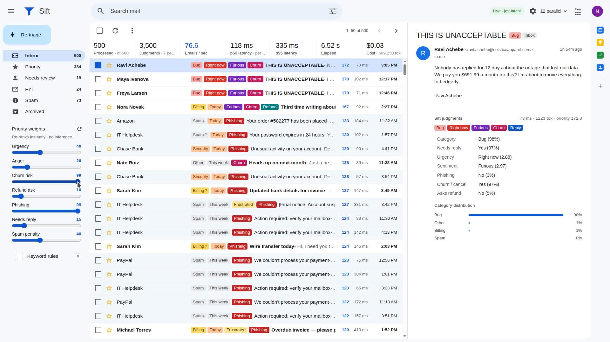
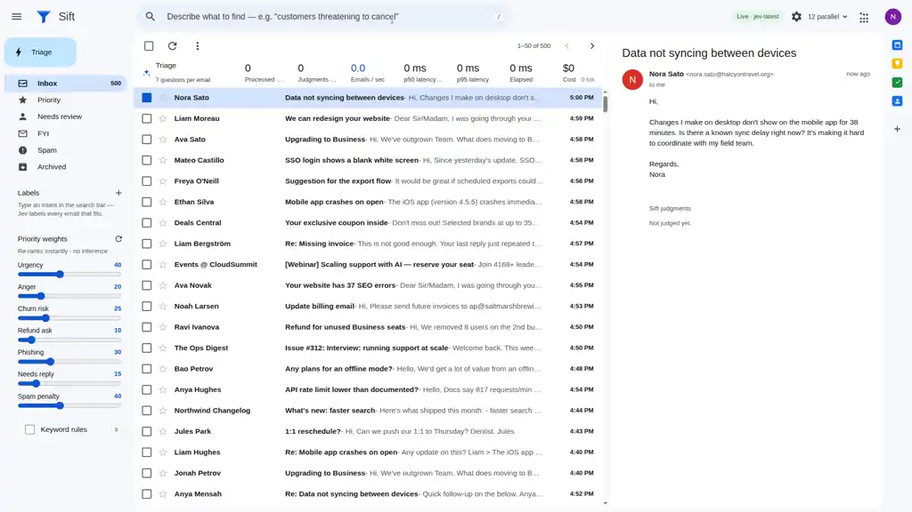

# Sift

**Type what you mean, get a label.** Describe emails in plain English — *"customers threatening to
cancel"*, *"sarcastic or passive-aggressive tone"* — and [TypeSafe Jev](https://docs.typesafe.ai)
judges all 500 emails against that description in ~5.5 s (p50 ≈ 115 ms), labelling and filtering
the inbox live as answers stream in. Stack labels to AND them. Plus the fixed triage pass:
**500 emails × 7 judgments = 3,500 judgments in 5.3 s**, sorted into a priority queue computed in code, with a
keyword-rule baseline on screen so you can see where regex fails.





## The problem

Support and sales inboxes get hundreds of messages an hour. Triage today is either a human
skimming subject lines, a keyword/regex classifier (fast but wrong on sarcasm, negation, quoted
history and marketing copy), or an LLM "summarise and classify" prompt per email — 2–5 s each,
minutes per batch, dollars per run, and a JSON-parsing step that breaks.

Jev is a *judgment* model: it does not generate text, it answers typed questions (choice / noul /
score) with probabilities in ~100–300 ms. That changes the shape of the solution:

- **All seven questions about one email go in one request.** Extra questions cost tokens, not
  latency. Seven dimensions arrive together in one round-trip.
- **Judgments are data.** The priority score is computed *in code* from the raw judgments, so
  changing the weighting re-sorts the queue with no new inference, no re-run.
- **Confidence is a first-class value.** Category confidence below 0.7 routes the email to a
  "needs human" lane instead of guessing.
- **Whole-inbox re-triage is cheap.** A full pass over 500 emails is ~5 s and ~$0.03, so changing
  the questions themselves (a new policy) is a re-run, not a project.

## Natural-language labels

The Gmail search pill is an *intent* box, not a keyword box. Type a description and press Enter:

1. `POST /api/label { intent }` fans out one request per email (12 in flight), each carrying a
   single `noul` question with the intent embedded in it:

   > An inbox operator wants to find emails that match this description: *"…"*. Read
   > `email.from`, `email.subject` and `email.body`. Does this email genuinely match the
   > description, judged by what the sender actually means and intends rather than by surface
   > keywords? — `true`: clearly fits · `false`: does not fit, or only mentions related words in
   > passing, sarcastically, in quoted history or in marketing copy.

2. Match probabilities stream back as NDJSON; the UI shows a one-line status (matches so far,
   emails judged, elapsed); per-request latency, p50/p95 and cost are measured in code but not
   displayed (the tables below come from those measurements).
3. Code does the rest: probability ≥ 0.5 gets the label (≥ 0.8 solid, 0.5–0.8 translucent), the
   inbox filters to matches, and when the run finishes the rows sort by match probability.
   Selecting several labels ANDs them; nothing is re-inferred.

Measured label runs over the 500-email fixture (real API, concurrency 12):

| intent | matches | elapsed | p50 | p95 | emails/s |
|---|---|---|---|---|---|
| customers threatening to cancel | 4 (all 4 real cancel threats; angry-but-staying emails at 18–46%) | 5.43 s | 114 ms | 198 ms | 92.1 |
| someone asking for a refund | 27 (double charges, unused seats, "credit for the difference"; the sarcastic *"Great job guys… love paying twice"* trap at 55%) | 5.75 s | 117 ms | 267 ms | 86.9 |
| sarcastic or passive-aggressive tone | 21 (top three are the sarcasm traps at 97/88/70%) | 5.89 s | 123 ms | 252 ms | 84.9 |
| production is down or broken for them | 81 (lock-outs, 502s, crashes at 92–96%; "data not syncing" borderline at ~58%) | 4.91 s | 100 ms | 182 ms | 101.8 |

Each run is 500 judgments and ~235k input tokens ≈ $0.01. Try it yourself from the CLI:
`npx tsx scripts/probe-intent.ts "a coworker asking me to do something"`.

## What Jev is asked in the triage pass

One `POST https://api.typesafe.ai/v1/systemone` per email, `model: "jev-latest"`, with
`state = { email: { from, subject, body } }` and these seven questions (verbatim from
[`server/jev.ts`](server/jev.ts)):

| id | type | question |
|---|---|---|
| `category` | choice | Which single category best describes what this email is primarily about? — `billing`, `bug`, `feature_request`, `sales_lead`, `security`, `legal_privacy`, `spam_marketing`, `internal`, `other`, each with a one-line criterion |
| `needs_reply` | noul | Does the sender expect a human at our company to write back? (mass mailings, automated notifications and newsletters do not) |
| `urgency` | score | How quickly does this email need action, based on the real situation (ignore sarcastic framing and marketing pressure tactics)? — Can wait a week / This week / Today / Right now |
| `sentiment` | score | The sender's actual emotional tone toward us, reading past politeness and sarcasm — Friendly / Neutral / Frustrated / Furious |
| `is_phishing_or_scam` | noul | Is this a phishing attempt or scam (credential theft, fake invoice, gift cards, fake authority)? Pushy but legitimate marketing is `false`. |
| `mentions_churn_or_cancel` | noul | Is the *sender themselves* cancelling or threatening to leave? (cancellation mentioned in marketing copy does not count) |
| `asks_for_refund` | noul | Does the sender ask us to refund or credit back money they paid? |

Everything else is plain code: priority weights, lane routing, the 0.7 confidence gate, the
keyword baseline, agreement stats, percentiles and cost.

## Measured run (real API, concurrency 12)

Measured server-side with `performance.now()` around each HTTP request; nothing is simulated.
Best of three full runs on a Linux VM; the other two took 5.8 s and 5.9 s.

| metric | value |
|---|---|
| emails | 500 |
| judgments | 3,500 (7 per email, one request each) |
| total elapsed | **5.27 s** |
| throughput | **94.9 emails/s** (664 judgments/s) |
| p50 request latency | **96 ms** |
| p95 request latency | 270 ms |
| errors / retries | 0 / 0 |
| input tokens | 609,250 |
| estimated cost | ≈ $0.03 (at $0.042 / M input tokens, output free) |

For comparison, a 2 s-per-email LLM summarisation pass would take ~17 minutes sequentially, or
~80 s at the same concurrency, and needs a text-parsing step Jev does not.

### Keyword rules vs Jev

Press `b` to run the classic regex/keyword classifier over the same 500 emails
([`src/lib/rules.ts`](src/lib/rules.ts)). It agrees with Jev on all seven dimensions for ~84% of
emails; the "Rules ≠ Jev" lane lists the rest with the full email body so you can judge who is
right. The fixture includes 20 hand-written traps that keyword rules get wrong and Jev gets right,
for example:

- *"Not urgent at all, take your time… just kidding. Prod is down for all of our warehouses"* —
  rules: can wait a week, neutral; Jev: **Right now, Frustrated**.
- *"Question about my invoice (I'm NOT cancelling!)"* — 'cancel' three times; rules flag churn; Jev: churn 2%.
- A newsletter whose copy says *"cancel anytime, full refund"* — rules flag churn + refund; Jev: no.
- *"Password reset link goes to a blank page"* — 'password', 'link', 'verify' → rules flag phishing;
  Jev: legitimate **bug**, phishing 4%. Meanwhile *"[Final notice] Account suspension"* from
  `no-reply@micros0ft-secure.com` is phishing 99%.
- *"quick favor"* — CEO gift-card scam with zero phishing keywords; rules miss it, Jev: phishing 74%.
- *"URGENT: your security score dropped this week"* — a vendor's cold pitch; rules: urgent
  security; Jev: `spam_marketing`, urgency *can wait a week*.

## How it runs

```
browser (Vite + React 19)  ──/api/triage──▶  node server (tsx)  ──12 concurrent──▶  api.typesafe.ai
        ◀── NDJSON stream: one line per email as its judgment lands ──
```

- `server/index.ts` — `POST /api/triage` fans out one request per email with a 12-wide worker
  pool, streams `{type:"result", id, judgment, latencyMs, inputTokens}` lines back as they arrive,
  retries 429/529/5xx with exponential backoff + jitter (honouring `retry-after`), 6 s per-request
  timeout. `POST /api/label { intent }` does the same with the single intent question and streams
  `{type:"match", id, match, latencyMs, inputTokens}`. The API key never leaves the server.
- `server/jev.ts` — typed question builders (`choice`, `noul`, `score`), the seven triage
  questions, the `intentQuestion(intent)` builder, request/response mapping.
- `src/useTriage.ts` — consumes the triage stream, batches UI updates every 50 ms, tracks live p50/p95.
- `src/useLabels.ts` + `src/lib/labels.ts` — intent labels: queued runs, match threshold, label
  naming, AND-intersection, sort-by-match, histogram summary; pure parts unit-tested.
- `src/lib/priority.ts` — priority score from raw judgments + weights; lane routing
  (priority / needs-human / FYI / spam); pure and unit-tested.
- `src/lib/rules.ts` — the keyword baseline and agreement/disagreement stats.
- `src/lib/stats.ts` — percentiles, throughput, token cost.
- `src/data/emails.ts` + `src/data/traps.ts` — deterministic generator (seed `20260917`) for 500
  synthetic emails: support bugs, billing, sales leads, vendor spam, newsletters, internal mail,
  security alerts, angry escalations, GDPR requests, phishing, threads with quoted history, and the
  20 traps. No real people, companies or addresses.

### Run it

```sh
cd inbox-blitz
npm ci
export TYPESAFE_API_KEY=...   # never shipped to the browser
npm run dev                   # server on :8787 + Vite on :5173, one command
```

Open http://localhost:5173, press `/`, type an intent (e.g. *customers threatening to cancel*)
and hit Enter — or press **Triage** for the fixed seven-question pass.

Intent labels are live-only (`MOCK=1` only has recorded answers for the seven triage questions).

Other commands:

```sh
npm run start        # production build + preview server + API server
MOCK=1 npm run dev   # replay recorded answers (UI shows a yellow MOCK badge); no key needed
RECORD_MOCK=1 npm run dev   # live run that also (re)writes server/mock-answers.json
npm run lint && npm run typecheck && npm test && npm run build
```

Keyboard: `/` focus the intent box, `j`/`k` or arrows move, `e` archive, `r` toggle
reply-needed, `b` toggle keyword rules, `Enter` start triage.

## Notes on question design

Wording was tuned against real API output on the trap fixtures. Changes that mattered:

- `urgency` explicitly says to ignore sarcastic framing and marketing pressure tactics — before
  that, "final notice" marketing scored as *Right now*.
- `is_phishing_or_scam`'s `false` criterion explicitly includes pushy/fear-based marketing and
  cold sales pitches from real companies — otherwise a legitimate security vendor's pitch was
  flagged as a scam.
- `mentions_churn_or_cancel` / `asks_for_refund` state that mentions in marketing copy or
  someone else's story do not count — that fixed the newsletter traps.
- `internal` names the company domain so a competitor's "we're switching" email is not
  classified as internal; `other` lists offboarding/export requests so they stop landing in
  `billing`.
- Phishing is surfaced at the top of the priority lane even though its category is
  `spam_marketing` — that is a policy decision in `priority.ts`, not something Jev decides.
