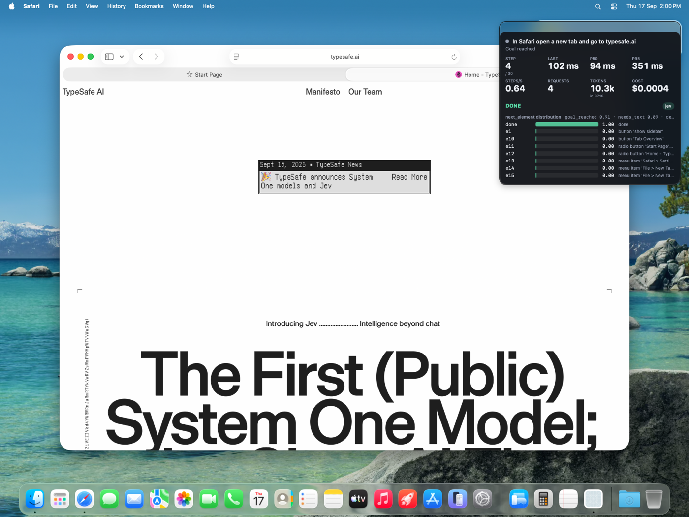
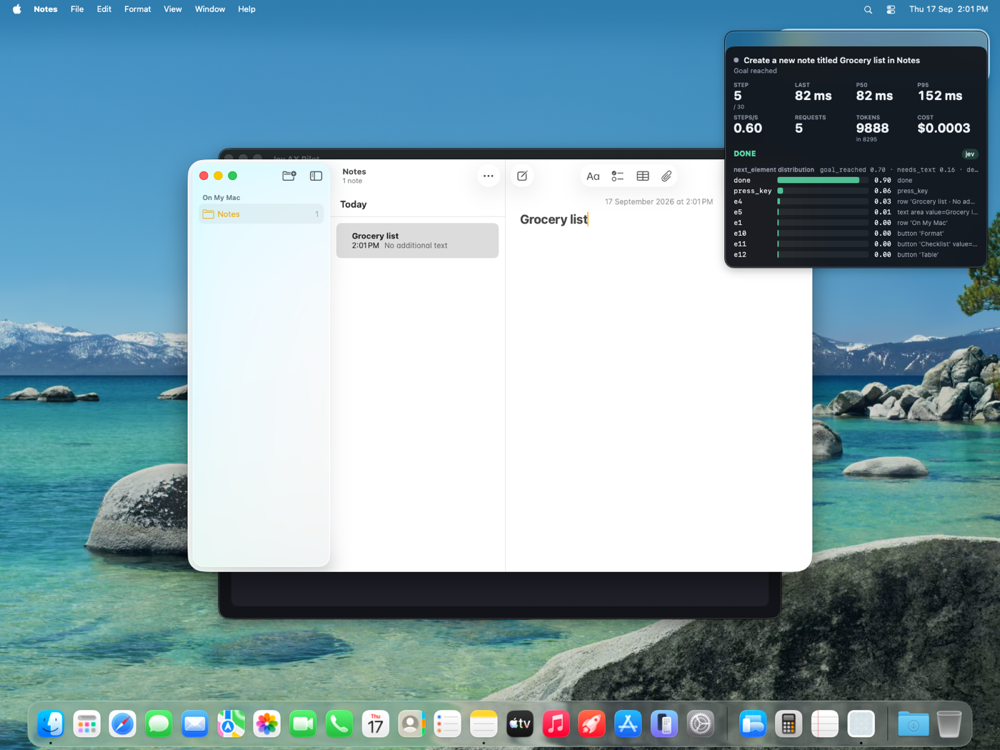
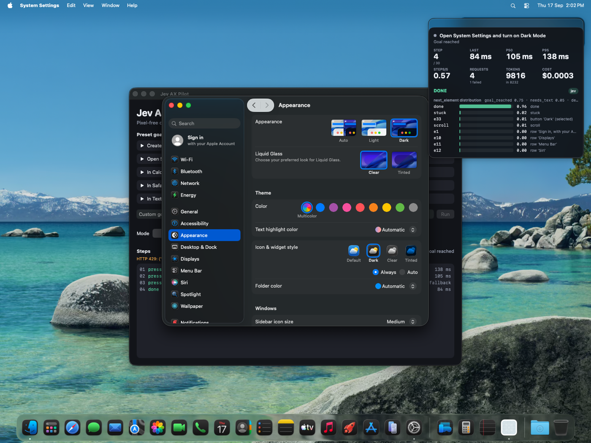
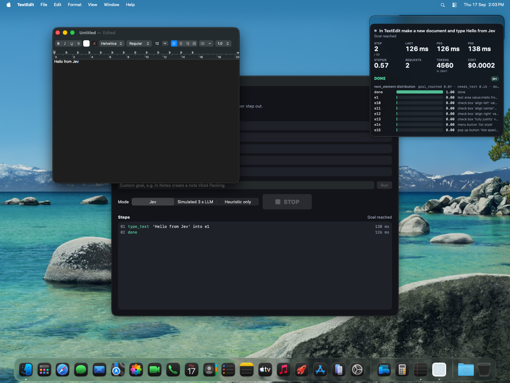
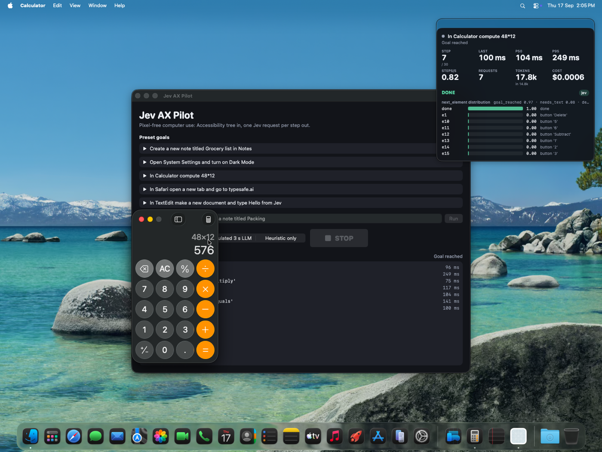
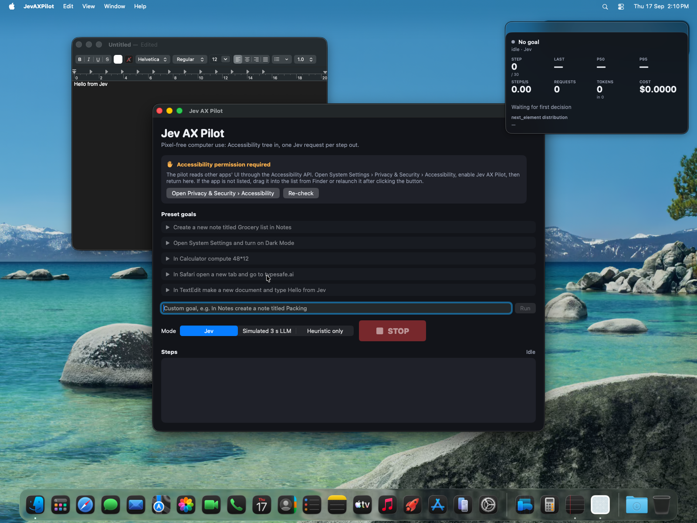

# Jev AX Pilot

Pixel-free computer use for macOS. A native SwiftUI agent that drives other apps through the
Accessibility tree instead of screenshots: it reads the frontmost app's `AXUIElement` hierarchy,
flattens the actionable elements into a compact JSON list, asks Jev (TypeSafe's System One model)
one batched question set per step, and executes the answer with `AXUIElementPerformAction`,
`AXUIElementSetAttributeValue` and CGEvent.


## Why speed matters here

A computer-use loop is observe -> decide -> act, repeated once per UI action. With a vision LLM
each step costs a screenshot upload and a 2-4 s generation, so a ten-click task takes half a
minute and feels like watching a robot. With Jev the decision is a typed judgment over ~2 k input
tokens of structured state and comes back in about 100 ms, so the loop is bounded by macOS's own
UI settle time rather than by the model. The HUD makes that visible: last / p50 / p95 latency,
steps per second, request count, tokens and cost update after every step, and a
"Simulated 3 s LLM" mode adds a typical-LLM delay to the same decisions so the difference is
obvious on screen.

## Measured results (live `jev-1.13.0`, macOS 26.5, Apple silicon)

All five preset goals completed end to end against the live API in the runs below. Latency is the
HTTP round trip for one batched request (5-6 questions); "AX read" is the time to walk the
frontmost app's tree.

| Goal | Steps | Requests | Jev p50 | Jev p95 | Input tokens (total) | Cost | AX read / step |
| --- | --- | --- | --- | --- | --- | --- | --- |
| In Calculator compute 48*12 | 7 | 7 | 104 ms | 249 ms | 14.8 k | $0.0006 | 40-70 ms |
| In TextEdit make a new document and type Hello from Jev | 2 | 2 | 126 ms | 138 ms | 3.8 k | $0.0002 | 37-75 ms |
| In Safari open a new tab and go to typesafe.ai | 4 | 4 | 94 ms | 351 ms | 8.7 k | $0.0004 | 58-170 ms |
| Create a new note titled Grocery list in Notes | 5 | 5 | 82 ms | 152 ms | 8.3 k | $0.0003 | 47-110 ms |
| Open System Settings and turn on Dark Mode | 4 | 4 (1 failed) | 105 ms | 138 ms | 8.2 k | $0.0003 | 140-350 ms |

- Median Jev latency across these runs is ~100 ms; the first request of a run is the slowest (TLS setup).
- Tokens per decision: ~1.9-2.1 k input, 240-450 output. Jev is billed per input token only
  ($0.042 per million, from the published model card), so a full task costs well under a cent.
- Wall-clock steps/sec is 0.6-0.8, dominated by the 250 ms settle delay after each action plus
  the AX read; Jev itself is 10-15% of a step.
- The System Settings run shows the fallback working: step 3 got an HTTP 429 from the API, the
  deterministic heuristic pressed the best goal-matching element instead, and the run still
  finished with Dark Mode on (`defaults read -g AppleInterfaceStyle` -> `Dark`).
- The same TextEdit goal in "Simulated 3 s LLM" mode: identical decisions, 0.13 steps/sec instead of 0.57.
- "Heuristic only" mode (no requests) finishes Calculator in 2 steps by typing `48*12` and Return
  as raw keystrokes, but has no judgement: it only completes goals whose outcome the code can
  check itself (arithmetic result visible, text typed into the focused field). On the recorded
  System Settings fixture it reports `stuck`: nothing in the General pane lexically matches
  "Dark Mode" until Appearance is open.

| Safari | Notes |
| --- | --- |
|  |  |

| System Settings | TextEdit |
| --- | --- |
|  |  |



## How it works

```
AXReader.snapshot(app)      AXUIElement walk -> AXSnapshot tree (role, title, value, desc,
                             enabled, focused, frame, actions), depth/child capped
TreeFlattener.flatten       prune disabled / offscreen / zero-size / decorative nodes,
                             keep <= 60 actionable elements with ids e1..eN, plus <= 14 lines
                             of visible text and the goal-relevant menu items
StateBuilder.state          compact JSON: goal, step, app, window title, focused element,
                             visible_text, elements, text_candidates, already_typed,
                             previous_actions, arithmetic facts
StateBuilder.questions      one TypeSafe request with 5-6 questions (below)
AnswerHandler.decide        thresholds + destructive guard -> PilotAction
Pilot.execute               AX press / set value / focus, CGEvent keys and clicks
```

The loop runs until `goal_reached` or `done`, `stuck`, a blocked destructive action, Stop / Escape,
or 30 steps. The UI never blocks on the network: each request races a 900 ms deadline, stale
answers (sequence number mismatch) are discarded, and a deterministic fallback acts if Jev is slow,
errors or is low confidence.

### The Jev questions

Each step sends one `POST /api/alpha/decisions` with `model: "typesafe/jev-1.13"` and these questions over the
state above (see `Sources/StateBuilder.swift`):

| id | type | what it decides |
| --- | --- | --- |
| `next_element` | Choice over `e1..eN` + `type_text`, `press_key`, `scroll`, `done`, `stuck` | which element to activate, or which pseudo-action applies |
| `key` | Choice over a fixed set (Return, Escape, Tab, Space, Delete, Up, Down, Cmd+N, Cmd+T, Cmd+L, Cmd+A, Cmd+W) | the shortcut to press when `next_element` is `press_key` |
| `goal_reached` | Noul | does the current UI state already show the goal achieved? |
| `needs_text_input` | Noul | is the next step typing text from `text_candidates`? |
| `is_destructive` | Noul | would the likely next action irreversibly change something the goal did not ask for? |
| `text` | Choice over the code-extracted candidates (only when there is more than one) | which candidate span belongs in the focused input |

Jev never generates text. `TextCandidates` extracts quoted spans, "titled X" / "type X" spans,
URLs and arithmetic expressions from the goal string in code; Jev only selects among them.
Arithmetic is evaluated in code and passed as `facts` so `48*12` becomes a sequence of button
presses and `goal_reached` can be judged against the expected `576`.

Code owns every threshold (`Sources/AnswerHandler.swift`): `goal_reached > 0.8` ends the run,
`done` is trusted only if `goal_reached >= 0.8`, or `>= 0.5` with the `done` choice itself at
`>= 0.5`; a weaker `done` acts on the runner-up element from the distribution if it has `>= 0.12`
(Settings: `done=0.46, Dark=0.28` presses Dark), and otherwise the loop re-observes up to three
times, which is how a still-loading Safari page is handled. Goals containing new/create/make can
never finish before at least one real action, so a pre-existing "Grocery list" note does not
satisfy "Create a new note". A choice with confidence below 0.12 falls through to the heuristic;
an element or key repeated twice in a row switches to the fallback.

Question wording and state were iterated against real runs (trace mode prints both). Two examples:
Calculator's first run ended "stuck" after pressing `4`, fixed by exposing the code-evaluated
arithmetic as `facts` and letting no-text-input apps take digits as keystrokes in the fallback;
Safari kept opening new tabs and pressing Return until `press_key` was described as "e.g. Return
to submit text already typed into the focused field", `done` was made to wait for `goal_reached`
while the page loads, and typed text that vanished from the UI (new tab) was re-added to the
candidates instead of being assumed delivered.

### Safety

- Elements whose label contains a destructive word (delete, empty trash, erase, send, pay,
  purchase, buy, remove, discard, trash, uninstall, format, reset, sign out, log out, shut down,
  restart) are flagged `destructive: true` in the state and are never pressed unless the goal
  explicitly names that word. The check is in `AnswerHandler.guardAction`, not in the prompt.
- If Jev's `is_destructive` Noul is above 0.5 for a chosen element and the goal does not name a
  destructive operation, the action is blocked and the run ends with the reason shown.
- The fallback heuristic skips destructive elements entirely.
- A large Stop button and a global Escape hotkey (local and global `NSEvent` monitors) cancel the
  loop immediately.

### HUD and highlight

`Sources/HUDView.swift` is a floating, non-activating panel: goal, status, step / 30, last / p50 /
p95 latency, steps per second, requests (with failed count), tokens (with input count), estimated
cost, the chosen action and its source (`jev` or `fallback`), and the full `next_element`
probability distribution as bars with each element's summary. The chosen element is highlighted
with a yellow rectangle in a transparent overlay window positioned from the element's AX frame
(`Sources/JevAXPilotApp.swift`).

## Run

Requirements: macOS 14+, Xcode 16+, XcodeGen 2.46.0 (`brew install xcodegen`), an OpenRouter API key.

```sh
cd jev-ax-pilot
export OPENROUTER_API_KEY=...            # or paste it into the app's key field (stored in UserDefaults)
xcodegen generate                      # only if you edited project.yml
xcodebuild -project JevAXPilot.xcodeproj -scheme JevAXPilot -configuration Debug \
  -destination 'platform=macOS' -derivedDataPath build CODE_SIGNING_ALLOWED=NO build
open build/Build/Products/Debug/JevAXPilot.app
```

The app reads the key from `OPENROUTER_API_KEY` first and falls back to the in-app field. The key is
sent only to `openrouter.ai` from the native process; it is never written to disk by the app
other than UserDefaults when you paste it, and never logged. Set `JEV_AX_PILOT_TRACE=1` to log the
flattened state and every decision to stderr.

### Accessibility permission

The pilot needs Accessibility (TCC) to read other apps' trees and post events. `Info.plist`
carries `NSAccessibilityUsageDescription`; on launch the app calls `AXIsProcessTrusted()` and, if
false, shows the panel below with a button that opens System Settings > Privacy & Security >
Accessibility and a Re-check button. Enable "Jev AX Pilot" in that list, then press Re-check.



Note from testing on this VM: the app's own TCC row (`com.devin.typesafe.jev-ax-pilot`) could not be
switched on through System Settings in the automated environment (the row appeared but stayed
disabled). Every run in this README was made by launching the built binary from a shell that
already had Accessibility trust, which macOS lets child processes inherit. On a normal Mac the
in-app panel flow is the expected path; this is an environment limitation, not something the app
works around.

## Limitations

- Only the preset goals above were verified end to end. Custom goals work through the same loop
  but the text-candidate extraction is heuristic (quoted spans, "titled X", "type X", URLs,
  arithmetic), so a goal that needs text the code cannot pick out of the string will not type it.
- The System Settings run pressed "Dark" twice: after the API 429 the heuristic matched the
  Appearance "Dark" button that was already selected and then Jev's second "Dark" was the icon
  style, which is harmless but not minimal. Fallback quality depends on how well labels match goal
  words.
- Runs are not idempotent: TextEdit and Notes each start a new document/note every run, and Safari
  opens a new tab each run. Calculator restores its previous expression on relaunch, so a repeat run
  can be judged `done` at step 2 if `576` is still on the display.
- Element frames from AX are used for the highlight overlay and for click fallbacks; apps that
  report stale frames (Safari's start page while loading) can put the highlight a few pixels off.
- Pricing is computed from the published per-input-token price for jev-1.13; output tokens are
  free per the model card. If that changes the HUD figure will be wrong; tokens are shown alongside.
- No third-party dependencies, no screenshots, no OCR: apps that expose nothing useful through
  Accessibility (custom canvases, some Electron apps) cannot be driven.

## Layout

```
project.yml                XcodeGen spec (app + unit-test targets, bundleIdPrefix com.devin.typesafe)
JevAXPilot.xcodeproj       generated, committed
Sources/
  AXNode.swift             AXSnapshot / AXNode model (also decoded from recorded fixtures)
  AXReader.swift           AXUIElement walk, actions, CGEvent keys/clicks, KeyChord table
  TreeFlattener.swift      pruning, caps, ids, destructive flags, goal relevance
  TextCandidates.swift     goal-string spans, URLs, arithmetic evaluation
  StateBuilder.swift       state JSON + batched questions
  AnswerHandler.swift      thresholds, fallback heuristic, destructive guard
  JevClient.swift          POST /api/alpha/decisions, key lookup, sequence numbers
  JevTypes.swift           request/response types, JSONValue, pricing constant
  Metrics.swift            latency percentiles, steps/sec, tokens, cost
  Pilot.swift              observe -> ask -> act loop, deadline race, execution, Escape hotkey
  ContentView.swift        control window (presets, custom goal, mode, Stop, permission panel, step log)
  HUDView.swift            floating metrics HUD with probability bars
  JevAXPilotApp.swift      app entry, HUD panel, highlight overlay
Tests/
  Fixtures/*.json          recorded AX trees for Notes, System Settings, Calculator, Safari, TextEdit
  *.swift                  38 deterministic tests, no network
docs/                      screenshots and GIF from the live runs above
```
