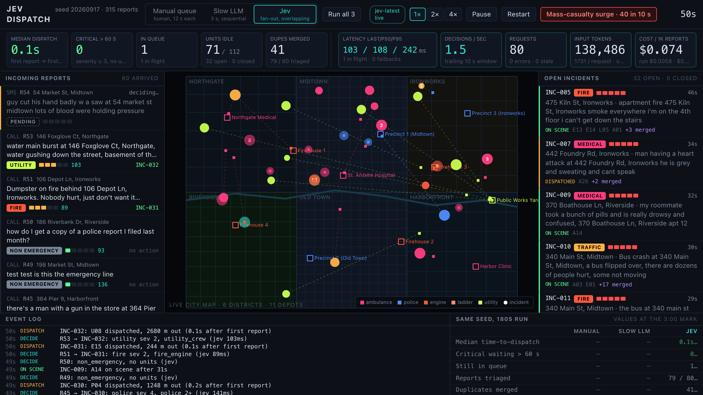
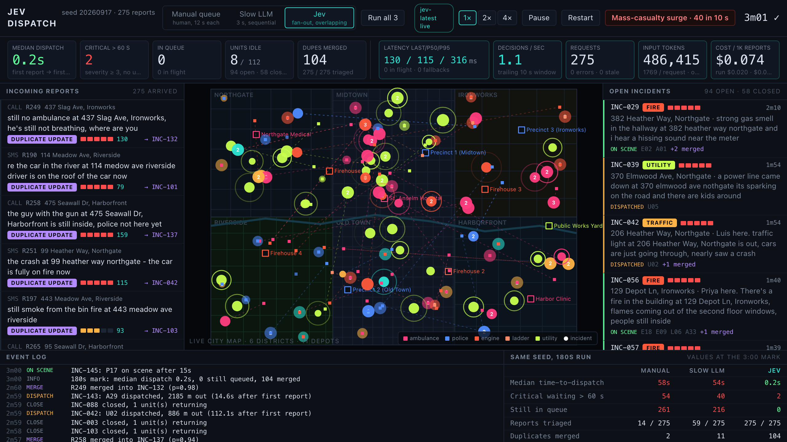
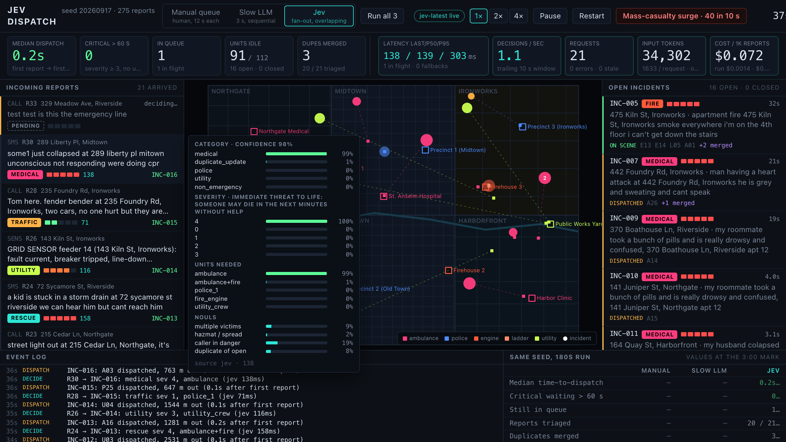
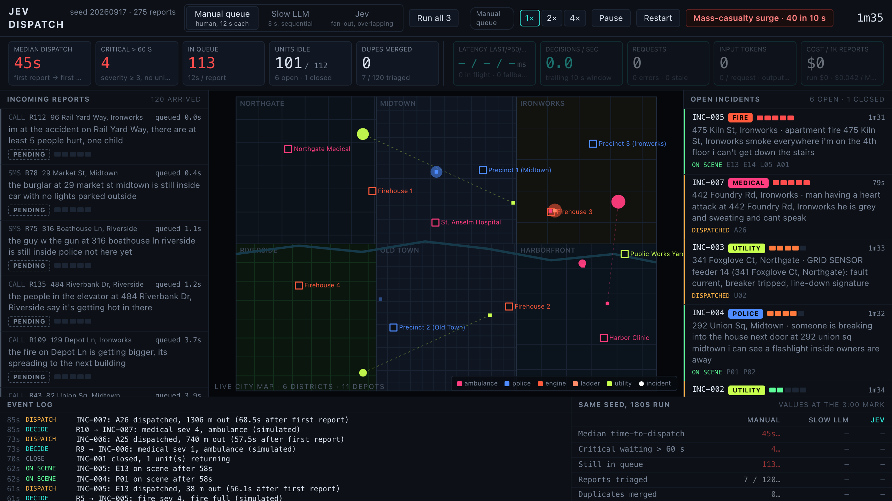

# Jev Dispatch

A dispatch-center console for a fictional city that triages incoming emergency reports at the speed they arrive. Free-text 911 transcripts, SMS and sensor alerts stream in at 1–5 per second in bursts; for every report one [TypeSafe](https://docs.typesafe.ai) fan-out request asks Jev seven typed questions (category, severity, victims, hazmat, caller danger, unit package, duplicate-of-open-incident). Code does the rest: merges duplicates into the open incident, sends the nearest available matching units, animates them across a procedural map, and keeps the KPIs honest.



## Why speed is the whole point

A report that sits in a queue is a person nobody is coming for yet. The console runs the same seeded 3-minute stream through three triage paths so the difference is fair and visible:

| Mode | How reports are triaged |
| --- | --- |
| **Manual queue** | FIFO; a simulated human dispatcher clears one report every 12 s |
| **Slow LLM** | One 3 s call per report, strictly sequential (a typical prompt-and-parse LLM step) |
| **Jev** | One fan-out request per report, up to 12 in flight, answers applied as they land |

Measured on seed `20260917` (275 reports in 180 s, 112 units) with `npm run bench` against the live API, 2026-09-17:

| Metric | Manual queue | Slow LLM | Jev |
| --- | --- | --- | --- |
| Reports triaged | 14 | 59 | 275 |
| Still in queue at 180 s | 261 | 216 | 0 |
| Median time-to-dispatch (first report → first unit rolling) | 57.7 s | 54.5 s | 0.2 s |
| Median triage time | 74.2 s | 44.4 s | 0.2 s |
| Critical incidents (severity ≥ 3) waiting > 60 s | 54 | 40 | 2 |
| Duplicates merged | 2 | 11 | 103 |
| Incidents open / closed | 4 / 7 | 24 / 19 | 95 / 58 |
| Units idle at 180 s | 106 / 112 | 83 / 112 | 6 / 112 |
| Jev requests (errors / stale / fallbacks) | – | – | 275 (0 / 0 / 0) |
| Jev latency p50 / p95 (browser-equivalent round trip from this machine) | – | – | 108 / 327 ms |
| Input tokens (per request) | – | – | 486,406 (1,769) |
| Est. cost per 1,000 reports | – | – | $0.074 |

The manual and slow-LLM medians look "only" 4–5× worse than they are because they cover the handful of reports that were triaged at all; the queue length is the real number. Jev's two critical incidents waiting > 60 s at the 3-minute mark are fleet exhaustion (6 idle units, 95 open incidents), not triage lag: median triage stayed at 0.2 s for the whole run.

Cost uses the published Jev price of $42 / Btok = $0.042 per million input tokens; output tokens are free. Each request carries the report plus up to five nearby open incidents and the seven question definitions, hence ~1.7k input tokens.



## Run

Node 22.12+ or 24. The API key stays on the server: the Vite dev middleware and `server.mjs` proxy `/api/jev` to `https://openrouter.ai/api/alpha/decisions`; the browser never sees the key.

```sh
cd jev-dispatch
cp .env.example .env         # or export OPENROUTER_API_KEY=...
npm ci
npm run dev                  # http://localhost:5173
```

Production: `npm run build && npm run preview` serves `dist/` and the proxy on port 4173 (`PORT` to override). Without a key the proxy answers 503 and the app keeps running on the deterministic fallback, clearly labelled.

Other scripts:

```sh
npm run bench                # 3-mode, 180 s same-seed benchmark; Jev leg runs in real time (~3 min)
npm run bench -- --surge-at 60 --skip-jev
npm run accuracy             # 40-report live sample compared with generator ground truth
```

## What is on screen

- **Top bar**: mode switch, `Run all 3` (manual → slow → Jev on the same seed, fills the comparison table), live/fallback status pill, 1×/2×/4× sim speed, pause, restart, `Mass-casualty surge · 40 in 10 s`.
- **KPI strip**: median dispatch time, critical waiting > 60 s, queue depth, idle units, duplicates merged; then the Jev block: latency last / p50 / p95, decisions per second (trailing 10 s), request count with errors / stale, input tokens, estimated cost per 1,000 reports.
- **Incoming reports** (left): channel, address, text, category chip, severity bar, per-request latency, and the outcome (`INC-014` new, `→ INC-005` merged, `no action`). Hover a report for the full probability breakdown.
- **Live city map** (center, plain canvas): six districts, street grids scaled to district density, a river, 11 depots, incidents pulsing by severity with merged-report counts, units moving along their dispatch lines and returning home.
- **Open incidents** (right): sorted by severity then age, with dispatched unit ids and merge counts.
- **Event log** and the **same-seed comparison table** (bottom).





## How the Jev questions are designed

One request per report, seven independent judgments, no text generation. State is a small JSON object:

```json
{
  "report": { "channel": "text message", "text": "...", "geocoded_address": "382 Heather Way, Northgate" },
  "nearby_open_incidents": [
    { "id": "INC-029", "category": "fire", "address": "...", "first_report": "...", "age_seconds": 41, "distance_m": 120, "units_dispatched": 2 }
  ]
}
```

| Question | Type | Judgment |
| --- | --- | --- |
| `category` | Choice | `fire, medical, police, traffic, utility, rescue, non_emergency, duplicate_update`; each criterion is one sentence naming the service, not keywords |
| `severity` | Score | five levels from "Information only" to "Immediate threat to life: someone may die in the next minutes without help" |
| `multiple_victims` | Noul | more than one person hurt, trapped or at risk |
| `hazmat_or_fire_spread` | Noul | spreading fire, explosion risk, fuel/gas, live wire |
| `caller_in_danger_now` | Noul | the sender is inside the hazard, not a bystander |
| `units_needed` | Choice | fixed package menu (`ambulance`, `ambulance+fire`, `police_1`, `police_2+`, `fire_engine`, `fire_full`, `utility_crew`, `none`); "pick the smallest package that covers every need" |
| `is_duplicate_of_open_incident` | Noul | same place and same kind of event as a listed open incident, "not by wording" |

Code owns every rule (`src/jev.ts`, `src/sim.ts`):

- **Merge**: if `is_duplicate_of_open_incident ≥ 0.6` or category is `duplicate_update`, merge into the nearest open incident within 350 m; if none qualifies, treat it as a new incident using the heuristic category so a mis-flagged duplicate is never dropped.
- **Confidence gate**: category confidence below 0.3 or an unknown label falls back to the keyword heuristic (shown as "low confidence → heuristic category" in the hover card). `units_needed = none` for an active category is replaced by the heuristic package.
- **Overlap and staleness**: up to 12 requests in flight, each tagged with the report; an answer for a report that already timed out (2.5 sim-seconds) is counted as stale and discarded. Timeouts and HTTP errors use the same deterministic fallback so the queue never stalls. 429/529 are retried with backoff inside the latency measurement.
- **Dispatch**: nearest available unit of each type in the package (returning units count as available), sorted by distance then id, so a run is reproducible given the same decisions.

Wording that mattered while iterating against real cases: telling `category` explicitly when to prefer `duplicate_update`, phrasing severity levels as consequences for people rather than labels, and making `units_needed` a "smallest package that covers every need" question so multi-need reports (bus crash: `ambulance+fire`) stop collapsing to a single service.

## Accuracy sample (40 live reports, hand-checked)

`npm run accuracy` runs Jev mode on the default seed until 40 reports are triaged and compares each decision with the generator's ground truth. Run on 2026-09-17, all 40 answered by Jev (0 fallbacks):

| Judgment | Agreement |
| --- | --- |
| Category (follow-ups count as `duplicate_update`) | 37 / 40 |
| Severity exact level | 26 / 40 |
| Severity within ±1 level | 40 / 40 |
| Unit package | 37 / 40 |
| Duplicate detection (merged iff the report is a follow-up) | 39 / 40 |

The disagreements, checked by hand:

- **R1, R13** "there's a guy sleeping in the doorway of … he doesn't look right": generator says `police / police_1`, Jev says `medical / ambulance` (severity 2). Jev's reading is defensible; the sample counts it as a miss.
- **R24** "a kid is stuck in a storm drain … we can hear him but can't reach him": truth `rescue / fire_engine / severity 3`, Jev `rescue / ambulance+fire / severity 4`. Category right; Jev sends the bigger package.
- **R15** "the lady who fell at 370 Boathouse Ln is in a lot of pain": a follow-up to an open incident, duplicate probability 0.40 (below the 0.6 gate), so it opened a second incident. The one duplicate miss in the sample.
- Severity was never off by more than one level; most ±1 cases were Jev rating slightly higher (e.g. "sewage smell and water from a drain" 2 vs 1).

The full 40-row table is what the script prints; the run used for the numbers above is reproduced verbatim in [TESTING.md](TESTING.md).

## Latency and cost, measured

From the benchmark run above (Node on this machine, direct to `openrouter.ai`): p50 **108 ms**, p95 **327 ms**, 275 requests, 0 errors. In the browser (through the Vite proxy) the KPI strip showed p50 110–160 ms and p95 240–400 ms across runs; one earlier run that overlapped a second concurrent stream on the same key hit 429s, which the client now retries with backoff. Tokens: ~1,730–1,770 input per request depending on how many open incidents are nearby, output free; **$0.074 per 1,000 reports**.

## Limitations

- The city, fleet, travel speeds and on-scene durations are stylised so a 3-minute demo saturates a 112-unit fleet; there is no routing on the street grid, units move straight-line at fixed speeds.
- Ground truth for the accuracy sample comes from the scenario generator, so "agreement" measures agreement with the scenario author, not with a certified dispatcher.
- Rate limits are not published in the docs; the retry policy is empirical.

See [TESTING.md](TESTING.md) for the clean-install checklist, what the tests cover and the full accuracy table.
