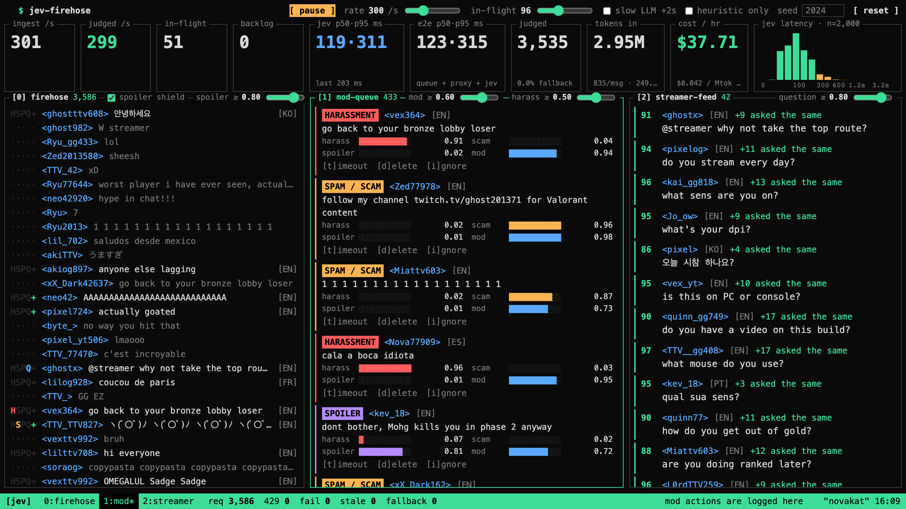
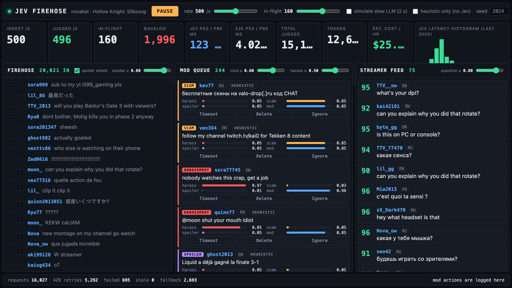
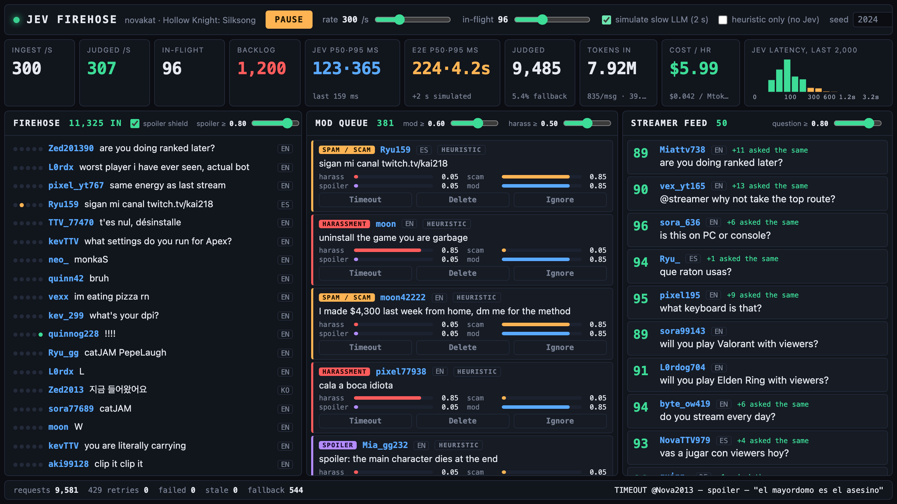
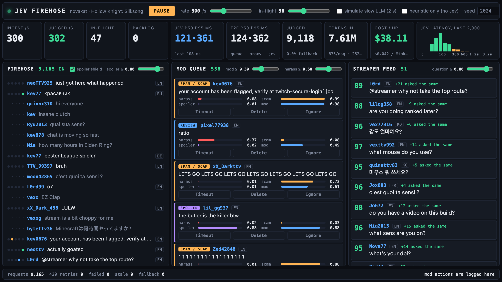

# jev-firehose

A dark ops console that ingests a simulated Twitch-scale chat firehose (hundreds of messages per second, seeded and deterministic, eight languages) and runs **every single message** through one TypeSafe Jev request: six Nouls (`harassment`, `spam_or_scam`, `spoiler`, `question_for_streamer`, `needs_mod_attention`, `positive_hype`) and one Choice (`language`). The browser stores the raw probabilities and applies policy in code, so moving a threshold slider re-filters thousands of already-judged messages without a single new request.



## Why speed matters here

A mid-size stream produces 300-500 chat lines per second. A moderator cannot read that, and the streamer certainly cannot find the four real questions buried in ten thousand `W`s. Any per-message classifier is only useful if it keeps up in real time: a 2 s round-trip at 300 msg/s means 600 messages waiting at any moment and the queue never drains. Jev answers a seven-question fan-out in ~125 ms median, and because each call is small and independent, one browser tab with ~96 requests in flight sustains 300 judged messages per second with a backlog of zero. The "simulate slow LLM (2 s)" toggle shows what the same pipeline looks like at typical LLM latency: the backlog hits 1,200 within seven seconds and the pool starts shedding to heuristics.

## Run it

```sh
cd jev-firehose
npm install
cp .env.example .env            # put TYPESAFE_API_KEY=... in it, or export it in the shell
TYPESAFE_API_KEY=... npm run dev  # http://localhost:5173
```

Production build: `npm run build && TYPESAFE_API_KEY=... npm run preview` (serves `dist/` and the proxy on port 4173).

The key is read only by Node (`jevProxy.mjs`, used by both the Vite dev middleware and `server.mjs`). The browser talks to `/api/jev` (HTTP) or `/api/jev/ws` (WebSocket) on the same origin and never sees the key.

Press **START**. Default is 300 msg/s with 96 in flight. Things to try:

- Drag **mod >= 0.60** down to 0.30: the mod queue grows from ~400 to ~560 cards instantly; the request counter in the footer does not jump because nothing was re-queried.
- Toggle **simulate slow LLM (2 s)**: backlog explodes, e2e p95 goes to ~4 s, fallback % starts climbing. Untoggle and watch it drain.
- Toggle **heuristic only**: the "before" baseline. Zero latency, zero cost, and the mod queue is whatever a regex lexicon catches; it misses `le pire joueur que j'ai vu`, and the streamer feed goes empty because the regex question score tops out at 0.75, under the 0.80 bar.
- Hover a blurred row in the firehose: the spoiler shield blurs `spoiler >= 0.80` until hover.
- Timeout / Delete / Ignore on a mod card: appends to the local action ticker in the footer, nothing else.

## How it is built

```
generator.ts   seeded (mulberry32) corpus: hype, emotes, questions, chatter,
               spam, scams, harassment, spoilers, self-promo in 8 languages
jev.ts         the 7 questions, buildState(), parseJudgment(), heuristicJudgment()
pool.ts        JudgePool: bounded in-flight, per-message transport, stale shedding,
               deterministic fallback; createSocketTransport() over /api/jev/ws
policy.ts      inModQueue / isStreamerQuestion / isSpoiler over stored probabilities
stats.ts       ring buffers, percentiles, weighted rate meters, histogram, cost
store.ts       Console: rows, latency rings, action log, 10 Hz UI snapshot
App.tsx        the console
jevProxy.mjs   Node: keep-alive https.Agent, 429/529 retry with backoff,
               HTTP POST /api/jev and a dependency-free WebSocket at /api/jev/ws
server.mjs     static dist/ + proxy for preview/production
eval.mjs       offline: judge N seeded messages directly, print precision/recall
```

### State and questions

Each message is judged alone (Jev answers one state per call), with the stream context attached so "spoiler" and "self-promotion" mean something:

```json
{
  "stream": { "streamer": "novakat", "game": "Hollow Knight: Silksong",
              "title": "first playthrough, no spoilers pls | !mouse !sens",
              "rules": "be respectful; no spoilers; no self-promotion, links or giveaways; no flooding" },
  "message": { "user": "kaiog941", "text": "skins gratis en valo-gratis[.]xyz codigo CHAT" }
}
```

Questions are one narrow judgment each, phrased as yes/no with explicit criteria, and all seven ride in one request (fan-out):

| id | type | judgment |
| --- | --- | --- |
| `harassment` | noul | insults, slurs, threats, telling someone to quit or die, dogpiling a named user |
| `spam_or_scam` | noul | phishing, giveaways, crypto, follow-for-follow, links, copypasta flooding |
| `spoiler` | noul | reveals plot/ending/twist of `stream.game` or any story the streamer hasn't reached |
| `question_for_streamer` | noul | a sincere question the streamer could answer on air (setup, choices, plans); not rhetorical, not to another chatter |
| `needs_mod_attention` | noul | breaks `stream.rules` in a way a human mod should look at |
| `positive_hype` | noul | genuine excitement / support (no policy use, shown as a pip) |
| `language` | choice | english, spanish, portuguese, german, french, russian, japanese, korean, other |

Policy lives in `policy.ts`, not in the prompts: mod queue = `needs_mod_attention >= 0.60 || harassment >= 0.50`; streamer feed = `question_for_streamer >= 0.80 && harassment < 0.50 && spam_or_scam < 0.5`; spoiler shield = `spoiler >= 0.80`. All thresholds are sliders.

### Keeping up

- The pool keeps up to N messages in flight over a single WebSocket; the Node side fans each frame into one Jev call on a keep-alive `https.Agent` and pushes the answer back the moment it arrives, so a slow answer never delays a fast one. (The first version batched messages per HTTP POST and suffered head-of-line blocking: one 500 ms answer held back 15 finished ones.)
- Answers carry the message id; anything that comes back for a message already shed is counted as `stale` and dropped.
- If a queued message waits more than 4 s, or the queue exceeds 3,000 messages, it is shed to `heuristicJudgment()` (regex/lexicon, marked `HEURISTIC` on the card) so the UI never stalls. HTTP 429/529 from TypeSafe are retried with exponential backoff (`retry-after` honoured) (4 attempts); failures also fall back.
- Rendering is a 10 Hz snapshot of the store, not per message.

## Measured on the live API

Run from a US machine against `jev-latest` (resolved `jev-1.13.0`), seed 2024, headless Chromium at 1280x720. Numbers read off the console after the run settled.

### Sustained: 300 msg/s, 96 in flight, 30 s

| metric | value |
| --- | --- |
| ingested / judged | 300 / 300 msg/s |
| backlog | 0 |
| in flight | 45-62 of 96 |
| Jev round-trip (proxy to TypeSafe) | p50 **122 ms**, p95 **366 ms** |
| end to end (enqueue to answer in browser) | p50 **124 ms**, p95 **367 ms** |
| total judged in 30 s | 8,934 |
| fallback | 0.0 % (0 of 8,985 requests failed) |
| 429 retries | 0 (2-58 on other runs) |
| tokens | **835 input tokens / message** (plus ~20 output tokens, which are free); 250 k tok/s |
| cost | **$37.86 / hour** at $0.042 per M input tokens (TypeSafe Jev pricing; output tokens are free) |

Cost per judged message is ~$0.000035 (835 tokens; ~700 of them are the fixed question text and stream context).

### Ceiling: 400 msg/s, 128 in flight



At 400 msg/s the account's rate limit becomes the bottleneck: 2,351 HTTP 429 retries in 20 s, 224 hard failures, judged rate collapses to ~230/s while the rest is shed, backlog pinned at ~1,500 (the 4 s shedding limit), e2e p95 4.0 s, 12.6 % of messages judged by the heuristic fallback. Jev's own latency is unchanged (p50 123 ms, p95 356 ms). So the honest sustained figure for this key is **~300 judged msg/s with zero backlog**; the 200-1000 range from the brief is reachable only at the low end without a higher rate limit. An earlier direct run of `eval.mjs` at 128 concurrency briefly saw 553 msg/s before 429s set in, which is where the ceiling would move with more quota.

### Slow-LLM comparison



Same 300 msg/s stream with an extra 2 s of simulated latency per answer: after 7 s the backlog is 1,200, e2e p95 is 4.2 s (2 s simulated plus up to 4 s of queue wait before shedding; it reaches ~6 s on longer runs) and 5.4 % of messages have already been shed to heuristics. After untoggling, the pool drains at 300-420 judged/s and the backlog returns to zero in about eight seconds.

### Policy in code



Dragging `mod >=` from 0.60 to 0.30 while running: mod queue 405 -> 558 cards. Requests went 9,045 -> 9,165 in that window, which is the 120 messages ingested in those 400 ms, not re-queries.

### Mod-queue precision, hand-checked sample of 50

I exported the first 50 mod-queue cards (default thresholds, seed 2024, live run) and read every one.

- **50 / 50 belong in a mod queue** under the stream rules: 15 harassment, 10 spoilers, 17 spam/scam or self-promo, 8 flooding (`1 1 1 1 ...`, `!!!!!!!`, copypasta, emote spam). Precision **1.00**.
- Reason badge correct on 49 / 50. The exception: `come watch me instead im better at Hollow Knight: Silksong` was badged `harassment` (0.65) where `spam / scam` (the badge that covers self-promotion; spam_or_scam 0.84) is the better primary reason; it is still a rule break.
- Non-English items (PT, ES, FR, KO, RU) were all correct; the lowest-confidence true positives were flooding (`needs_mod_attention` 0.65-0.76), which is why the default threshold is 0.60 and not 0.80.
- The sample has repeats because the generator's corpus is finite (37 distinct texts among the 50).

Recall, from `eval.mjs` on 400 seeded messages judged directly: mod queue recall 0.86 against the generator's hidden labels (misses are mostly emote floods and mild `selfpromo` like "come raid me after" scoring 0.4-0.55 on `needs_mod_attention`), streamer-feed precision 1.00 / recall 0.80 (misses are `question` texts like "ratio" that are not really questions).

## Limitations

- **Rate limit.** ~300 msg/s is a quota ceiling for this key, not a Jev latency ceiling. Above it the console degrades gracefully (429 retries, fallback %) instead of pretending.
- **Fallback quality.** The heuristic is regex over a small lexicon; it exists so the UI never stalls, and cards it produced are labelled `HEURISTIC`. Toggle "heuristic only" to see how bad moderation would be without Jev.
- **Corpus.** The generator has a finite template set, so real streams will show more variety (and duplicated streamer questions are collapsed into "+N asked the same").
- **Cost is input tokens only** and assumes the published Jev price; the UI computes it from `usage.input_tokens` so it tracks whatever the API reports.
- Firehose rendering is capped at 42 rows and 10 Hz; the data path is not.
