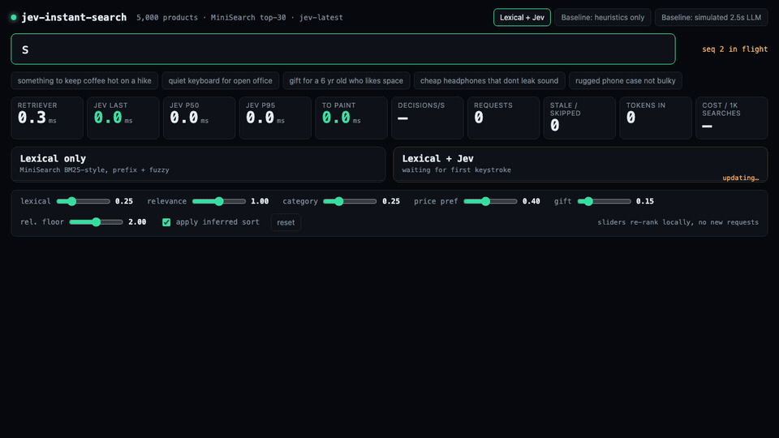
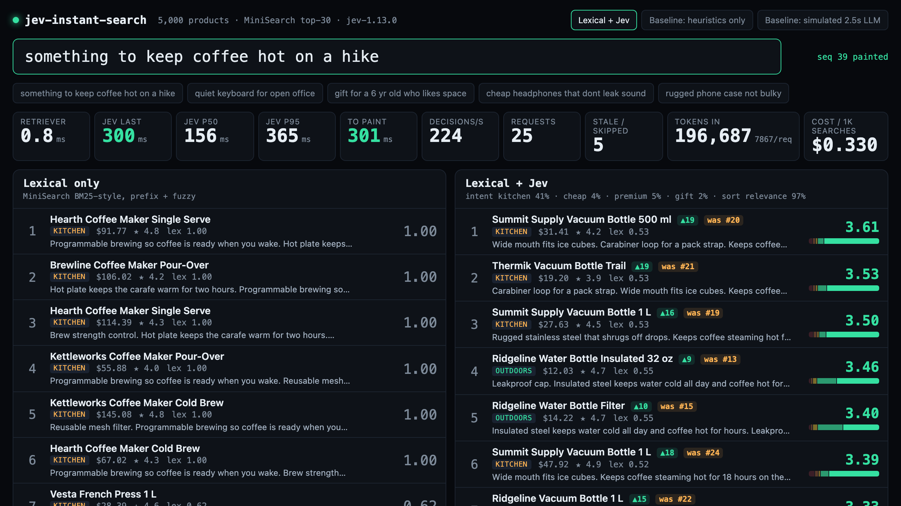
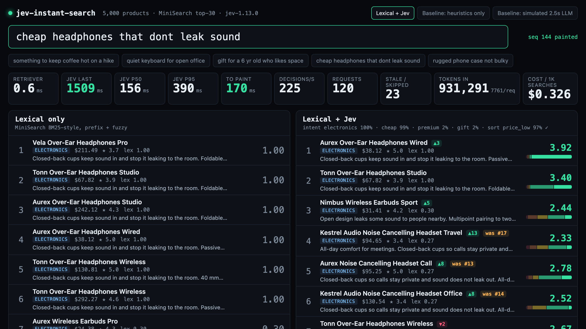
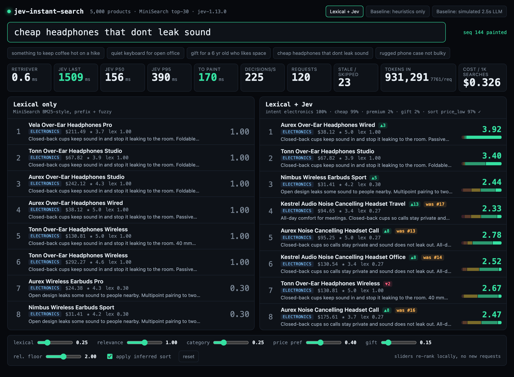
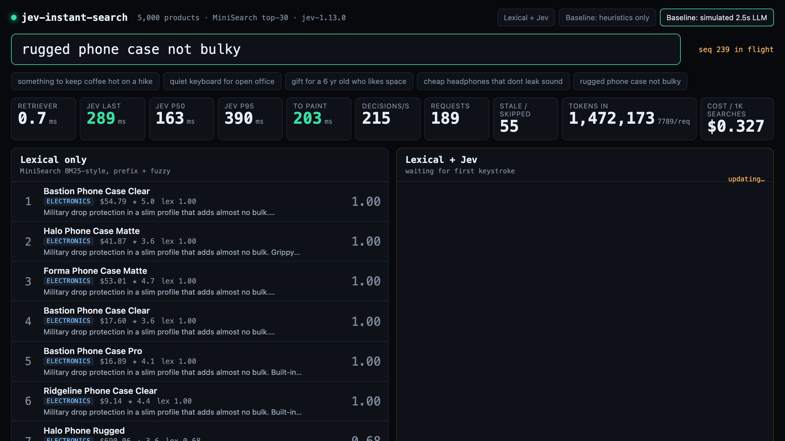

# jev-instant-search

Search-as-you-type over a local catalog of 5,000 products, where every keystroke is
re-ranked semantically by [Jev](https://docs.typesafe.ai) inside the keystroke budget.

Per keystroke the code does two things:

1. **Lexical retrieval, local.** MiniSearch 7.2.0 (BM25-style, prefix + fuzzy) returns the
   top 30 candidates. Warm: 0.4–1.3 ms. Cold first query: 7–10 ms (index warm-up).
2. **Semantic re-rank, one Jev request.** A single fan-out request asks 30 `Score`
   questions ("how relevant is candidate N to the query?") plus five query-level
   questions (intent category, wants cheap, wants premium, is gift, sort preference).
   Median round trip **~150 ms**, ~7,800 input tokens, **$0.33 per 1,000 searches**.

The split screen shows **Lexical only** on the left and **Lexical + Jev** on the right,
both updated on every keystroke.



## Why speed matters here

Re-ranking is only useful in a search box if it lands while the user is still looking at
the results for what they just typed. A typical LLM round trip (2–4 s) is 10–20 keystrokes
late; by the time it arrives the query has changed. Jev answers a 35-question fan-out in
about the time a network round trip takes, so the semantic ranking can ride along with the
keystroke instead of being a separate "smart search" step. The app makes that visible:
retriever ms, Jev last/p50/p95, time to paint, decisions per second, requests, stale
answers dropped, tokens and cost are all live on screen, and a **simulated 2.5 s LLM**
baseline shows what the same UI feels like when the model is slow.

## Run it

```sh
cd jev-instant-search
cp .env.example .env        # put your key in OPENROUTER_API_KEY
npm ci
OPENROUTER_API_KEY=... npm run dev          # http://localhost:5173
```

Production-style:

```sh
npm run build
OPENROUTER_API_KEY=... npm run preview      # node server.mjs, serves dist/ on :4173
```

The browser only ever calls `/api/jev`. In dev a Vite middleware plugin
(`vite.config.ts` -> `server/jev-proxy.mjs`) forwards it to
`https://openrouter.ai/api/alpha/decisions` with the server-side key; in preview/production
`server.mjs` does the same. The key never reaches the client bundle.

Other scripts: `npm run lint`, `npm run typecheck`, `npm test`, `npm run build`,
`npm run bench` (live batching benchmark), `npm run eval` (live offline relevance eval).

## Screenshots

Taken with headless Chromium at 1280×720 against the live API (see [TESTING.md](TESTING.md)).

"something to keep coffee hot on a hike" — lexical returns coffee makers, Jev returns
vacuum bottles:



"cheap headphones that dont leak sound" — Jev detects `wants_cheap` 99% and
`sort_preference: price_low` 97%; open-back and $200+ items drop, a $38 closed-back pair
leads:



Full page with the ranking sliders (they re-rank locally, no new requests):



Simulated 2.5 s LLM baseline: the previous ranking stays painted and dimmed while the slow
answer is in flight:



More: [02-keyboard](docs/02-keyboard.png), [03-space-gift](docs/03-space-gift.png),
[05-phone-case](docs/05-phone-case.png),
[06-fast-typing-stale-dropped](docs/06-fast-typing-stale-dropped.png).

## How the Jev questions are designed

Everything Jev sees is one JSON `state` object per keystroke:

```json
{
  "query": "cheap headphones that dont leak sound",
  "candidates": [
    { "id": "el-0031", "title": "...", "description": "...", "category": "electronics", "price_usd": 38.12, "rating": 5.0 },
    ...30 items
  ]
}
```

and one request carries 35 questions (`src/jev.ts`, `buildRequest`):

| id | type | instructions (abridged) | criteria |
|---|---|---|---|
| `rel_0` … `rel_29` | score | "How well does the product at `candidates[N]` satisfy the shopper's search `query`? Judge what the product is for and its stated features against what the shopper wants, including who it is for and any constraint they mention. Sharing a word with the query does not make it a match." | 5 ordered levels: unrelated → same general area but not what they asked for → partially matches → good match → exactly what they asked for |
| `intent_category` | choice | "Which store department is the shopper's `query` looking in?" | electronics, kitchen, outdoors, toys, office, any — each with a one-line description of what the department holds |
| `wants_cheap` | noul | "Does the shopper's `query` ask for a cheap, budget, inexpensive or affordable product?" | true / false descriptions |
| `wants_premium` | noul | "Does the shopper's `query` ask for a premium, high-end, luxury, professional or best-quality product?" | true / false descriptions |
| `is_gift` | noul | "Does the shopper's `query` say the product is a gift or present for another person?" | true / false descriptions |
| `sort_preference` | choice | "How should the results for the shopper's `query` be ordered?" | relevance, price_low, price_high, rating — each described in terms of what the shopper said |

Design notes:

- The relevance instruction says explicitly that sharing a word with the query is not a
  match and names what does matter (what it is for, who it is for, constraints). The
  candidates are the lexical top 30, so by construction they all share words with the query;
  the question has to be about intent or it adds nothing.
- The relevance question is asked per candidate but batched into one request. The score's
  probabilities are shown as the mini bar next to each result (`p(unrelated)` on the left,
  `p(exactly)` on the right).
- Query-level questions are asked once per request and gated by confidence before they
  change anything (`src/rank.ts`, `GATE`): intent bonus needs ≥ 0.45, `wants_cheap` /
  `wants_premium` / `is_gift` need ≥ 0.6, an inferred sort needs ≥ 0.5. Below the gate the
  code does nothing rather than half-apply.
- Everything else is code: the final score is
  `w_lexical·lex + w_relevance·score/4 + w_category·p(intent)·[category matches] + w_price·(cheap·cheapness − premium·cheapness) + w_gift·p(gift)·[giftable]`,
  candidates whose Jev score is below the relevance floor are pushed to the bottom, and an
  inferred `price_low` / `price_high` / `rating` sort is applied **within relevance bands**
  (floor of the Jev score) so a cheap unrelated item can never outrank a good match.
- If the request fails (network, 429, missing key) the right column falls back to a
  deterministic heuristic (regexes for cheap/premium/gift/rating) and the error is counted
  on screen. The app never blocks on the network.

## Staying inside the keystroke budget

- Every keystroke gets a **sequence number** (`src/sequence.ts`, `SequenceGate`). An answer
  is painted only if its sequence is newer than what is on screen; otherwise it is dropped
  and counted as "stale". Requests are never cancelled, so a slow early answer cannot
  overwrite a fast later one.
- The previous right-column ranking stays painted (dimmed, "updating…") until a fresh
  answer arrives.
- At most **4 requests in flight** (`InFlightLimiter`). Beyond that only the newest keystroke
  is held and sent when a slot frees; intermediate keystrokes are skipped. Without this cap,
  typing at ~15 ms per character produced 30+ concurrent requests and the API returned
  `429 Too Many Requests` for some of them.
- Sliders change weights and re-run `combine()` on the already-painted answers; no request.

## Measured numbers

All numbers below are from real runs against `jev-1.13.0` on 2026-09-17 from a macOS VM.
Nothing is simulated except the "simulated 2.5 s LLM" mode, which is labelled as such.

### In-app metrics after typing all five example queries character by character (70 ms/char)

| metric | value |
|---|---|
| retriever (warm) | 0.4–1.3 ms per keystroke |
| Jev p50 | 149–158 ms |
| Jev p95 | 365–394 ms (one 1.5 s outlier observed in 146 requests) |
| time to paint (retrieve + Jev + render), typical | 120–300 ms |
| decisions per second (35 decisions / p50) | 221–234 |
| input tokens per request | ~7,760–7,870 |
| output tokens | ~640 per request (not billed) |
| estimated cost per 1,000 searches | **$0.33** (at $0.042 / 1M input tokens) |
| stale / skipped answers over 146 keystrokes | 29 |

Typing the headphones query at 15 ms/char (faster than a human): p95 394 ms, 162 requests
total, 54 skipped or dropped, zero errors, last paint 203 ms after the final keystroke.

### Batching vs concurrency (`npm run bench`, 20 keystrokes per row)

Re-ranking 30 candidates can be one request with 30 score questions, or N smaller requests
in parallel. Measured wall time per keystroke from Node (no browser, no proxy):

| batch size | requests / keystroke | wall p50 (ms) | wall p95 (ms) | input tokens / keystroke | 429s |
|---|---|---|---|---|---|
| **30** | **1** | **138** | **215** | **7,845** | 0 |
| 15 | 2 | 183 | 329 | 8,115 | 0 |
| 10 | 3 | 216 | 471 | 8,385 | 0 |
| 5 | 6 | 353 | 619 | 9,225 | 0 |
| 1 | 30 | 439 | 626 | 15,945 | 0 |

Findings:

- **One request with all 30 candidates is fastest and cheapest.** Jev's latency is
  dominated by the round trip, not by the number of questions; adding 29 questions to a
  request costs a few tens of milliseconds while every extra parallel request adds its own
  tail. Splitting also duplicates the query-level state in every request (tokens per
  keystroke double at batch size 1).
- Concurrency gets worse, not better, as it grows: p95 rises monotonically from 215 ms at
  one request to 626 ms at 30, and an earlier 20-round run of the batch-1 row died with
  `429 Rate limit exceeded` (the bench now retries 429s and reports them).
- A full 30-candidate re-rank therefore completes in ~140 ms median, ~215 ms p95 from Node
  and ~150 / ~380 ms through the browser + dev proxy — comfortably inside the 500 ms
  target. The app uses batch size 30 with a cap of 4 overlapping keystrokes in flight.

### Offline relevance eval (`npm run eval`)

Top 5 for each example query in both columns, labelled by hand. Labels: **E** exactly what
they asked for, **G** good match, **P** partial, **S** same area but not it, **U** unrelated.
Descriptions are abridged to the feature that decides the label.

**"something to keep coffee hot on a hike"** — intent kitchen 46%, sort relevance

| # | Lexical only | label | Lexical + Jev | label |
|---|---|---|---|---|
| 1 | Hearth Coffee Maker Single Serve $92 | S | Summit Supply Vacuum Bottle 500 ml $31 — keeps coffee hot 18 h on the trail | E |
| 2 | Brewline Coffee Maker Pour-Over $106 | S | Summit Supply Vacuum Bottle 1 L $28 | E |
| 3 | Hearth Coffee Maker Single Serve $114 | S | Thermik Vacuum Bottle Trail $19 — carabiner loop for a pack strap | E |
| 4 | Kettleworks Coffee Maker Pour-Over $56 | S | Summit Supply Vacuum Bottle 1 L $48 | E |
| 5 | Kettleworks Coffee Maker Cold Brew $145 | S | Ridgeline Vacuum Bottle 1 L $46 | E |

Lexical 0/5, Jev 5/5. "coffee" + "hot" match coffee-maker descriptions word for word; Jev
understands "on a hike".

**"quiet keyboard for open office"** — intent electronics 100%, sort relevance

| # | Lexical only | label | Lexical + Jev | label |
|---|---|---|---|---|
| 1 | Keystone Low-Profile Keyboard Wireless $29 — minimal noise | E | Keystone Low-Profile Keyboard Wireless $29 | E |
| 2 | Slate Low-Profile Keyboard Slim $37 — minimal noise | E | Tacto Low-Profile Keyboard Wireless $99 | E |
| 3 | Tacto Low-Profile Keyboard Wireless $99 — minimal noise | E | Slate Low-Profile Keyboard Wireless $124 — whisper-quiet, open-plan | E |
| 4 | Tacto Low-Profile Keyboard Wireless $49 — whisper-quiet, open-plan | E | Slate Low-Profile Keyboard Slim $37 | E |
| 5 | Slate Low-Profile Keyboard Wireless $124 | E | Tacto Low-Profile Keyboard Wireless $49 | E |

Both 5/5. The catalog's low-profile keyboards literally say "quiet" and "open-plan
offices", so lexical already wins; Jev agrees (all scores ≥ 3.8). The difference is lower
down: lexical puts silicone *keyboard covers* at 7–12 (they match "keyboard"), while Jev
scores them 0.6–0.7 and pushes them below the floor, and lifts the tactile-brown-switch
mechanical keyboards ("quiet enough for a shared office", scored 2.6–2.9) into 7–12
instead. Noise-reducing desk dividers land at 0.9 ("same general area").

**"gift for a 6 yr old who likes space"** — intent toys 100%, is_gift 99%, sort relevance

| # | Lexical only | label | Lexical + Jev | label |
|---|---|---|---|---|
| 1 | Brightwood Brick Set Space Shuttle $27 — ages 6 to 10, gift box | E | same | E |
| 2 | Brightwood Brick Set Space Shuttle $37 | E | same | E |
| 3 | Brightwood Brick Set Space Shuttle $64 | E | Brightwood Brick Set Space Shuttle $35 | E |
| 4 | Brightwood Brick Set Space Shuttle $41 | E | Brightwood Brick Set Space Shuttle $64 | E |
| 5 | Brightwood Brick Set Space Shuttle $41 | E | Brightwood Brick Set Space Shuttle $41 | E |

Both 5/5 on the top five (the catalog has only one space-themed brick archetype, so the
shortlist is dominated by its variants). The difference is lower down: positions 13–30 on
the left are "Gift Card Holder", "Fountain Pen Gift Set" and "Hot Sauce Gift Set" (they
match "gift"); Jev scores those 0.03–0.15 and they sit below the floor, and the foam rocket
launcher toys ("great backyard gift for kids who love space") score 3.0–3.4 at 7–12.

**"cheap headphones that dont leak sound"** — wants_cheap 99%, sort price_low 96%

| # | Lexical only | label | Lexical + Jev | label |
|---|---|---|---|---|
| 1 | Vela Over-Ear Headphones Pro $211 — closed-back | P (not cheap) | Aurex Over-Ear Headphones Wired $38 — closed-back | E |
| 2 | Tonn Over-Ear Headphones Studio $68 — closed-back | G | Tonn Over-Ear Headphones Studio $68 — closed-back | G |
| 3 | Aurex Over-Ear Headphones Studio $242 — closed-back | P (not cheap) | Nimbus Wireless Earbuds Sport $31 — open design, leaks sound | S |
| 4 | Aurex Over-Ear Headphones Wired $38 — closed-back | E | Kestrel Noise Cancelling Headset Travel $95 — closed-back | G |
| 5 | Tonn Over-Ear Headphones Wireless $131 — closed-back | P (not cheap) | Aurex Noise Cancelling Headset Call $95 — closed-back, does not leak | G |

Lexical 1 E / 1 G / 3 P; Jev 1 E / 3 G / 1 S. Jev gets the cheap+closed pair to #1 and
removes the $200+ items, but it scores the $31 open-design earbuds 2.4 ("partially
matches") which the price_low sort then lifts to #3 within the 2.x band. That is the one
visible miss in this eval and is why the relevance floor and banding exist; raising the
floor slider to 2.5 hides it.

**"rugged phone case not bulky"** — intent electronics 100%, sort relevance

| # | Lexical only | label | Lexical + Jev | label |
|---|---|---|---|---|
| 1 | Bastion Phone Case Clear $55 — drop protection, slim, almost no bulk | E | same | E |
| 2 | Halo Phone Case Matte $42 — slim armor | E | Forma Phone Case Matte $53 — slim armor | E |
| 3 | Forma Phone Case Matte $53 — slim armor | E | Ridgeline Phone Case Clear $9 — slim armor | E |
| 4 | Bastion Phone Case Clear $18 — slim armor | E | Bastion Phone Case Pro $17 — slim armor | E |
| 5 | Bastion Phone Case Pro $17 — slim armor | E | Halo Phone Case Matte $42 — slim armor | E |

Both 5/5. "bulk" matches the slim-armor description text, so lexical happens to get it.
Jev's contribution is at positions 7–30: the rugged *phones* that lexical pulls in via the
word "Rugged" in their title score ~0.7, rugged laptop bags ~0.3, and "Printer Paper Ream
Case" and die-cast toy cars with a "collector case" ~0.1 — all below the floor, so the six
real phone cases are the only undimmed rows.

Summary: over 25 top-5 slots per column, lexical is 16 E / 1 G / 3 P / 5 S and Jev is 21 E
/ 3 G / 0 P / 1 S. The clearest wins are the two queries whose intent is not in the words
("on a hike", "cheap … dont leak"); the other three are cases where the catalog text
already contains the query words and Jev's value is in what it pushes *down* (keyboard
covers, gift card holders, paper ream cases).

## What was not feasible / caveats

- Jev p95 through the browser (365–394 ms) is higher than from Node (215 ms); the extra is
  the dev proxy hop plus the browser being busy re-rendering while typing. One 1.5 s outlier
  was observed in ~150 requests. The UI is designed so an outlier just means one keystroke
  paints late and its answer is then dropped as stale.
- The API rate-limits bursts. The in-flight cap of 4 avoids it at human typing speed; the
  bench script hit it once at 30 parallel requests per keystroke before the retry was added.
- The catalog is synthetic (seeded, deterministic). Titles reuse a brand + type + variant
  template so several results can share a title and differ only in description and price.
