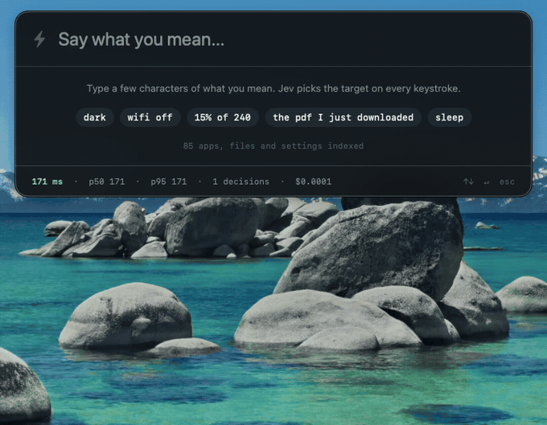
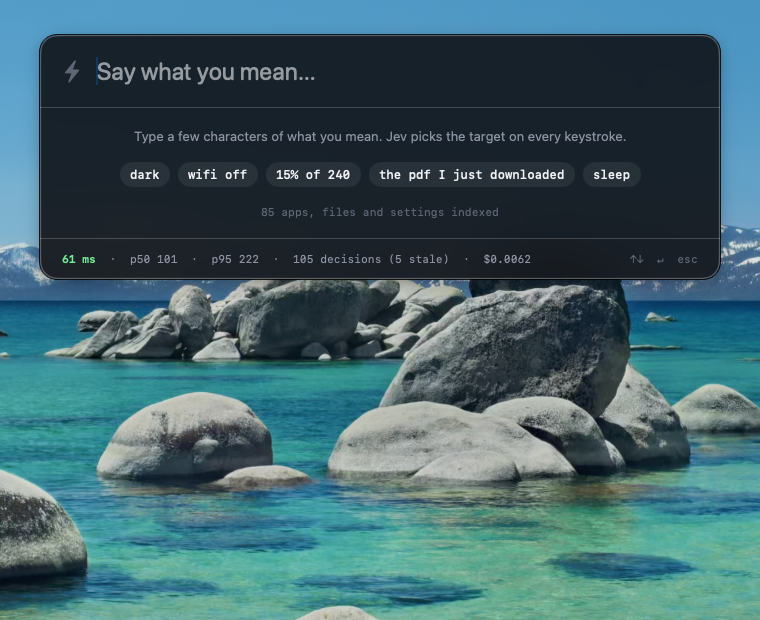
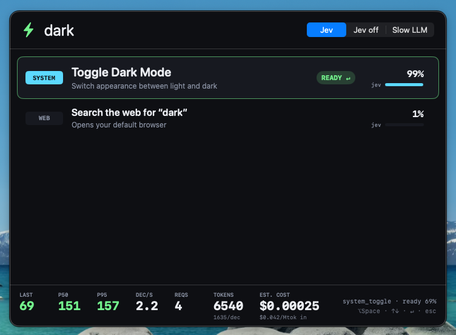
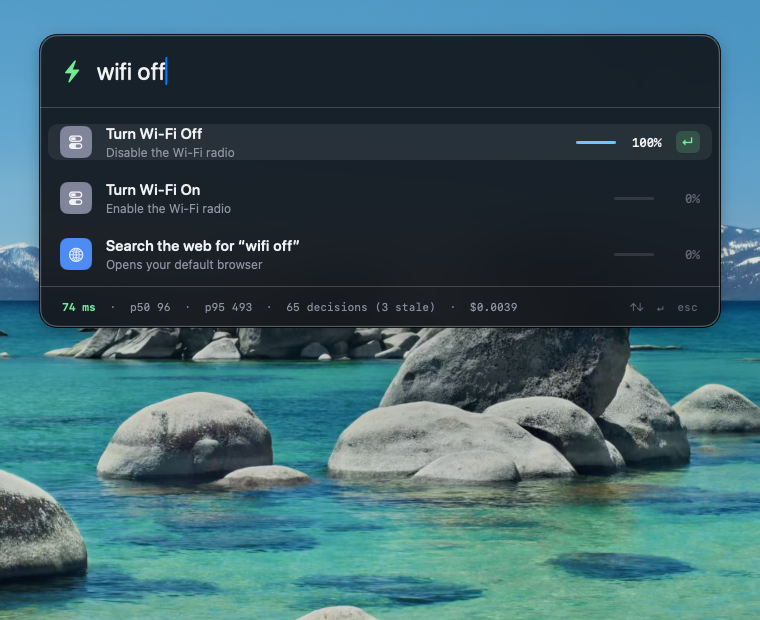
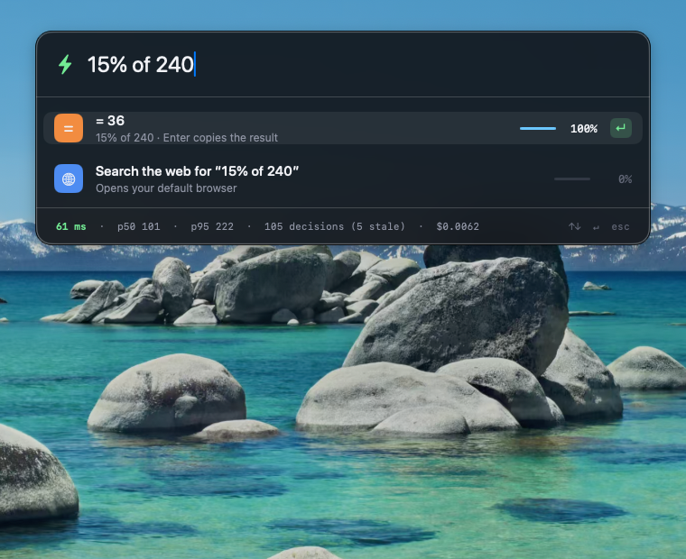
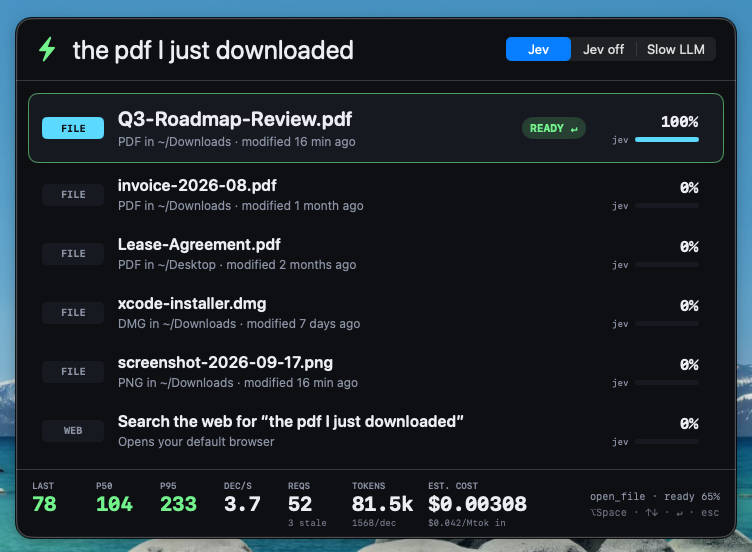
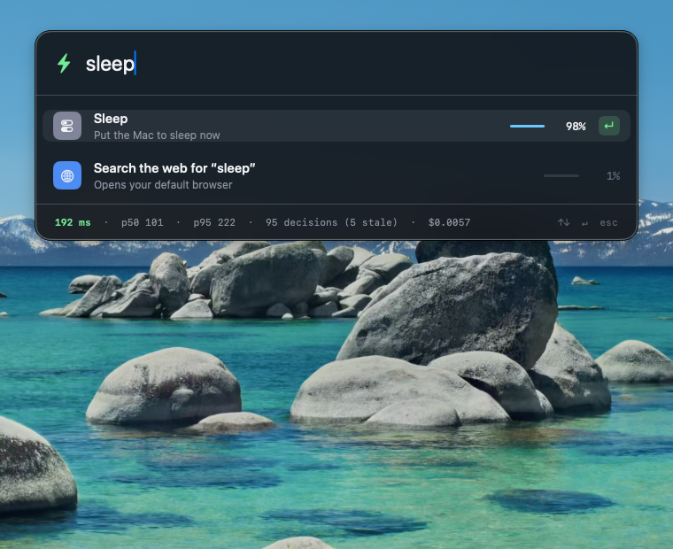
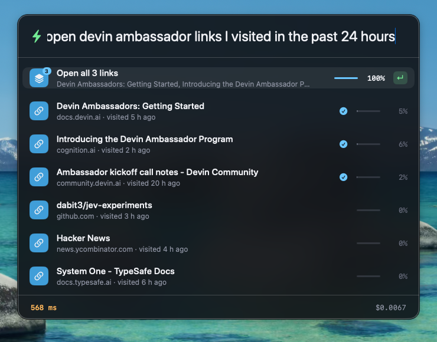

# Jev Launcher

A Spotlight-style launcher for macOS that reads intent, not strings. Press ⌥Space and type the way you would say it — `dark`, `wifi off`, `the pdf I just downloaded`, `15% of 240`, `open the devin ambassador links I visited in the past 24 hours` — and on **every keystroke** the panel sends the query plus local context and the top local candidates to [Jev](https://docs.typesafe.ai) in one fan-out request. Jev answers typed questions (intended target, intended action kind, one item or all of them, which rows fit the description, "is this unambiguous enough to run on Enter?"), the list re-ranks live, and the top hit shows Jev's probability. When the intent is settled the top row gets a green ↵; Enter runs it — one file, or a whole set of links at once.



The recording above is one uninterrupted session against the live API: 58 requests, median round-trip **115 ms**, p95 **302 ms**, nine stale answers discarded (the script types at ~20 chars/s), $0.0034 total.



## Why speed matters

A launcher is judged per keystroke. Anything above ~200 ms feels like lag, which is why nobody puts a general LLM (2–4 s) between the keyboard and the results list. Jev returns a full three-question judgment in about 100 ms on this VM, so the list can re-rank on every character with **no debounce**: the app fires a request per keystroke, tags each with a sequence number, applies whatever comes back newest-first and drops the rest. The footer shows two live numbers: the last round-trip in ms and the running cost estimate; hovering it shows p50 / p95, decision count and tokens per decision.

## Measured numbers

All figures are from real runs on this macOS VM (macOS 26.5, ARM64, Xcode 26.6) against `jev-latest`, which resolved to `jev-1.13.0`.

| Metric | Value | Where measured |
|---|---|---|
| Median round-trip (p50) | **101 ms** | footer after the 105-request screenshot session (`docs/query-calc.png`) |
| p95 round-trip | 222 ms | same session |
| Fastest / slowest observed | 61 ms / ~1 s (one outlier; first request of a session pays cold TLS ~500 ms) | footer during the sessions in `docs/` |
| Requests in the screenshot session | 105 (one per keystroke, five queries typed twice, 5 stale discarded) | `docs/query-calc.png` |
| Input tokens per decision | ~1,400 (`state` with up to 15 candidates + 3 questions) | `usage.input_tokens`; $0.0062 / 105 requests at $0.042 per Mtok |
| Output tokens | 0 | `usage.output_tokens` is always 0 for typed judgments |
| Cost per decision | $0.00006 | footer estimate: $0.0062 for 105 requests (output is free per the pricing docs) |
| Cost of a five-query session | ~$0.003 | footer; the whole 22 s GIF is 58 requests, $0.0034 |

Every question in the request comes back in the same round-trip, so "three judgments per keystroke" costs the same latency as one.

### The five ambiguous queries

Each screenshot is the live panel after typing the query at human speed (~120 ms per character). The top hit is correct in every case and carries the green ↵ ready badge. The panel only grows to the rows it has: one toggle plus the web fallback is two rows, the PDF query is six.

| Query | Top hit | Jev target probability | Screenshot |
|---|---|---|---|
| `dark` | Toggle Dark Mode | 99% |  |
| `wifi off` | Turn Wi-Fi Off (not "Turn Wi-Fi On", which has the same fuzzy score) | 100% |  |
| `15% of 240` | `= 36` (code-evaluated; Enter copies it) | 100% |  |
| `the pdf I just downloaded` | `Q3-Roadmap-Review.pdf` (modified 58 min ago) over five older PDFs and a DMG | 100% |  |
| `sleep` | Sleep | 99% |  |

For comparison, the pure fuzzy matcher scores `invoice-2026-08.pdf` and `Q3-Roadmap-Review.pdf` identically on that PDF query and wins the tie by list order; the same fuzzy order is what the panel falls back to when Jev is unreachable (see Failure handling in TESTING.md).

## One item or all of them



Typing `open devin ambassador links I visited in the past 24 hours` produces the panel above. What happens, in order:

1. **Time window, in code.** `TimeWindow.parse` recognises `past 24 hours`, `last hour`, `yesterday`, `today`, `this week`, `last month`, `this morning`, `earlier today`, `a few days ago`… and turns it into a `since`/`until` pair. Only candidates dated inside the window are eligible; the phrase is removed from the text that gets fuzzy-matched. The window is also passed to Jev as `time_window` so it does not have to re-derive it.
2. **Chrome history, in code.** `ChromeHistory` copies each profile's `History` SQLite file (Chrome holds a lock on the original), reads `urls` for the last 90 days / 3,000 rows, keeps `http(s)` only, merges duplicates across profiles and turns each into a candidate: page title, host, `visited 2 h ago`, plus host and title words as keywords. Only the rows that survive the window and fuzzy filter — up to 30 with a window, 13 without — are sent; the database itself never leaves the machine.
3. **Two more questions in the same request.** `scope` is a **Choice** between `one` ("a specific item") and `all` ("every candidate that fits"). `match_cN` is one **Noul** per real candidate: "does this row fit the description?", the [rerank pattern](https://docs.typesafe.ai/cookbooks/rerank_typesafe) from the TypeSafe cookbooks. Both come back in the same round-trip as `target`, `action` and `ready` — 2.7k input tokens, 160–330 ms on this VM for the 24-hour query.
4. **Group row, in code.** Rows with `match ≥ 0.6` (at least two, at most 25) form the set. The panel adds a synthetic `Open all 3 links` row: first when `P(all) ≥ 0.5`, right under the best single hit when Jev is torn (`0.15 ≤ P(all) < 0.5`), and not at all when the query is clearly about one thing (`P(all) < 0.15`, e.g. `the pdf I just downloaded` scores 0.00 even though five PDFs individually "fit"). Members get a checkmark; ↓ still moves through them one by one. The group row is ready (green ↵) only when `P(all) ≥ 0.75`.
5. **Enter opens them in Chrome.** `.group` payloads open all URLs with one `NSWorkspace.open(_:withApplicationAt:)` call to Chrome (default browser if Chrome is not installed); non-URL members run through the normal single-item path. Nothing runs without Enter.

The same machinery is not Chrome-specific. `the files I downloaded in the last hour` yields `Open all 3 files` (P(all) = 1.00) over the three PDFs modified in the last hour, with the older ones excluded in code before Jev sees them. Mixed sets (`Open all 4 items`) are supported too.

| Query | P(all) | Top row | Set |
|---|---|---|---|
| `open devin ambassador links I visited in the past 24 hours` | 1.00 | Open all 3 links | three Ambassador pages (0.89–0.94); GitHub, HN, TypeSafe docs from the same day at ≤ 0.06; a 70-hour-old duplicate excluded by the window |
| `the files I downloaded in the last hour` | 1.00 | Open all 3 files | the three PDFs modified in the last hour |
| `pages about typesafe I read today` | 0.99 | System One – TypeSafe Docs | one match, so no group row |
| `the pdf I just downloaded` | 0.00 | Q3-Roadmap-Review.pdf (target 1.00) | none offered |
| `dark` / `wifi off` | 0.00 | Toggle Dark Mode / Turn Wi-Fi Off | none |

## How the Jev questions are designed

One request per keystroke (`POST /v1/systemone`, `model: jev-latest`). Jev never generates text; it only picks among options the code supplies. Everything else — indexing, fuzzy prefiltering, arithmetic, execution — is plain Swift.

**State** (`Sources/JevQuestions.swift`):

```json
{
  "query": "the pdf I",
  "query_note": "Text the user has typed so far into a Spotlight-style macOS launcher. It is often an incomplete prefix or a short natural-language phrase.",
  "context": { "frontmost_app": "Finder", "recent_apps": ["Finder", "Safari"], "clipboard_kind": "text", "time_of_day": "afternoon", "weekday": "Thursday" },
  "candidates": [
    { "id": "c0", "kind": "open_file", "title": "Q3-Roadmap-Review.pdf", "detail": "PDF in ~/Downloads · modified 16 min ago" },
    { "id": "c1", "kind": "open_file", "title": "invoice-2026-08.pdf", "detail": "PDF in ~/Downloads · modified 1 month ago" },
    { "id": "c6", "kind": "web_search", "title": "Search the web for “the pdf I”", "detail": "Opens your default browser" }
  ]
}
```

Candidates are the top 13 fuzzy matches from the local index (30 when the query names a time window) plus synthetic entries (an arithmetic result when the query parses, and a web search for any non-empty query). They carry short ids (`c0`…`cN`) that the code maps back to the real candidates when the answer arrives, so Jev only ever sees a few dozen rows, never the whole index or the browser history. A parsed time window is included as `time_window`.

**Questions** (all in one `questions` object; `scope` and `match_cN` are described above):

1. `target` — **Choice** over `c0…cN` plus `none`. "Which entry in `candidates` is the item they intend to open or run? Treat `query` as a possibly incomplete prefix or paraphrase… Match on meaning." The full probability distribution is used, not just the argmax: each row's bar is `probabilities[cK]`.
2. `action` — **Choice** over `open_app`, `open_file`, `web_search`, `calculate`, `system_toggle`, `run_shortcut`, `unclear`, each with a one-line rubric. Used as a secondary ranking signal (a candidate whose `kind` matches the chosen action gets a boost).
3. `ready` — **Noul**. "The launcher is about to run the best-matching candidate the instant the user presses Enter. Is `query` already unambiguous enough for that?" with explicit yes/no criteria. The top row gets the green ↵ badge when this is ≥ 0.6, or when Jev gives one target ≥ 90% probability. The second rule exists because on the PDF query Jev's `ready` hedges at ~0.4 (three PDFs "fit roughly equally" by title) while its `target` distribution is 98–100% on the newest one; a target that certain is, by construction, one where the remaining candidates are not plausible.

**Ranking** is deterministic given the answer: `score = 0.65 · P(target) + 0.20 · P(action matches kind) + 0.15 · fuzzy`, plus `0.25 · P(all) · P(match)` for rows in the set so members sit together under the group row. Without an answer (request failed, no key, or nothing back yet) the score is just `fuzzy`, so the panel always has a sensible order and never waits on the network.

**In-flight handling**: every query change increments a sequence number and starts a `Task`. A response is applied only if its sequence is newer than the last one applied; otherwise it is discarded as stale. While a newer request is in flight the previous judgment is kept, dimmed, so the list does not flicker back to fuzzy order between keystrokes.

**Iteration notes.** The `ready` wording went through several rounds against the five queries plus deliberately ambiguous ones, probed with a small `curl` harness outside the app. The first version ("is this unambiguous?") scored 0.3–0.4 even for `dark`. Telling Jev that `candidates` is the complete option set, that `web_search` is only a fallback, and giving one concrete example of a short-but-unambiguous prefix produced this spread with the final wording (one probe each, same candidate sets as the app):

| Query | Candidates | `ready` |
|---|---|---|
| `calc 15% of 240` | = 36, Calculator, web | 0.88 |
| `the pdf I just downloaded` | 3 PDFs of different ages, web | 0.84 |
| `dark` | Toggle Dark Mode, web | 0.64 |
| `da` | Toggle Dark Mode, Dashboard, web | 0.29 |
| `sle` | Sleep, Slack, web | 0.29 |
| `wifi` | Turn Wi-Fi Off, Turn Wi-Fi On, web | 0.16 |
| `s` | Sleep, Safari, Slack, web | 0.13 |

`wifi` alone is correctly not ready (on or off?) while `wifi off` is; `sle` is correctly torn between Sleep and Slack. The `target` question needed the explicit hint that `detail` carries recency ("the PDF whose `detail` says it was modified most recently") before "the pdf I just downloaded" reliably preferred the newest file over the alphabetically first one.

## What is local (code, not Jev)

- **Index** (`LocalIndex.swift`): `.app` bundles in `/Applications`, `/System/Applications`, `/System/Applications/Utilities`; files in `~/Downloads`, `~/Desktop`, `~/Documents` (top level + one nested level, capped at 400 per folder, with modification age in the subtitle); user Shortcuts from `shortcuts list`; nine system toggles; Chrome history (`ChromeHistory.swift`, every `Default`/`Profile *` under `~/Library/Application Support/Google/Chrome`, last 90 days).
- **Time windows** (`TimeWindow.swift`): relative (`past 24 hours`, `last 3 days`, `a couple of weeks ago`), named (`today`, `yesterday`, `this week`, `last month`, `this morning`, `tonight`, `last night`, `just now`, `recently`) and number words, resolved against the local calendar.
- **System toggles** (`Executor.swift`): Dark Mode (AppleScript to System Events), Wi-Fi on/off (`networksetup -setairportpower`), Do Not Disturb (`x-apple.systempreferences:com.apple.Focus-Settings.extension`), Sleep (AppleScript), Lock Screen (`CGSession -suspend`), Empty Trash (AppleScript to Finder), Show/Hide hidden files (`defaults write` + `killall Finder`).
- **Calculator** (`Calculator.swift`): a recursive-descent parser for `+ - * / ^ ( )`, `x` as multiply, `sqrt`, percentages (`15% of 240`, `200 * 10%`), with an optional `calc`/`=` prefix. No `NSExpression`, no eval.
- **Fuzzy prefilter** (`Fuzzy.swift`): exact / prefix / word-initial / subsequence scoring over title and keywords with stopwords stripped.
- **Execution**: `NSWorkspace.open` for apps, files and web searches; URLs and URL groups go to Chrome when installed (default browser otherwise), passed as values, never through a shell; the calculator result is copied to the clipboard.

## Run

Requirements: macOS 14+, Xcode 16+ (built with 26.6), [XcodeGen](https://github.com/yonaskolb/XcodeGen) 2.46.0 only if you change `project.yml`, and a TypeSafe API key.

```sh
cd jev-launcher
export TYPESAFE_API_KEY=...        # read from the environment; never hardcoded
./run.sh --show                    # builds Debug and launches with the panel open
```

`run.sh` execs the binary from the shell so the environment variable is inherited. If you launch the `.app` from Finder instead, the key is read from the Settings field (menu bar ⚡ → Settings…, stored in `UserDefaults` under `typesafeAPIKey`). With no key the panel still works as a fuzzy launcher and the empty state says `TYPESAFE_API_KEY is not set — local matching only`.

- **⌥Space** toggles the panel from anywhere (Carbon `RegisterEventHotKey`; no Accessibility permission needed).
- **↑ / ↓** move the selection, **↵** runs it, **esc** hides the panel. The example chips in the empty state are clickable.
- The menu-bar ⚡ item has Toggle Launcher, Settings… and Quit. The app has no Dock icon (`LSUIElement`). The index is rebuilt in the background each time the panel is shown.
- The panel is a translucent `NSVisualEffectView` HUD that resizes to its content (72 pt header, 56 pt rows up to seven, 40 pt footer). App and file rows show the real Finder icon; toggles, the calculator and web search use tinted SF Symbols. A small dot next to the field shows while a request is in flight; the bolt turns green when the top row is ready.

### Permissions

- **Automation (Apple Events)** — the first Dark Mode, Sleep or Empty Trash toggle prompts "Jev Launcher wants to control System Events / Finder". `NSAppleEventsUsageDescription` is set in `project.yml`. The build is unsandboxed so it can read the folders it indexes.
- **Wi-Fi** toggling uses `networksetup`, which may ask for an administrator password on some macOS versions.
- **Folders** — macOS asks once for Downloads, Desktop and Documents. Chrome's history lives under `~/Library/Application Support`, which needs no prompt.
- Nothing else: no Accessibility, Screen Recording or Full Disk Access.

## Build and test

```sh
xcodebuild -project JevLauncher.xcodeproj -scheme JevLauncher -configuration Debug \
  -destination 'platform=macOS' -derivedDataPath build CODE_SIGNING_ALLOWED=NO build
xcodebuild -project JevLauncher.xcodeproj -scheme JevLauncher -configuration Debug \
  -destination 'platform=macOS' -derivedDataPath build CODE_SIGNING_ALLOWED=NO test
xcrun swift-format lint --strict --recursive Sources Tests
```

58 tests cover the calculator, fuzzy scorer, prefilter and ranker, request construction and response parsing, latency/cost statistics, recency phrasing, file candidates, Wi-Fi port parsing, Chrome timestamp conversion, reading a copied `History` database, time-window parsing and filtering, set membership, group placement and the `scope`/`match_cN` questions. 52 are offline; `LiveJevTests` (5) hit the real API and are skipped unless `JEV_LIVE=1` and `TYPESAFE_API_KEY` are set in the test runner. See [TESTING.md](TESTING.md).

## Limitations

- **The list is always shown.** The brief asked whether intent is clear enough to execute "without showing a list". Hiding the list on a probabilistic signal felt wrong for a launcher, so readiness is surfaced as the green ↵ badge on the top row instead; Enter always runs the selected row regardless.
- **Latency is network-bound.** The numbers above are from a US VM; p50 will track your distance to `api.typesafe.ai`. The first request of a session pays TLS setup (~500 ms).
- **Fast typists generate stale answers.** Typing far faster than ~10 chars/s produces overlapping requests; the newest answer always wins, but the stale count climbs and p95 rises because the API is handling several requests at once. At ~8 chars/s the screenshot session discarded 5 of 105; the 20 chars/s GIF script discarded 9 of 58.
- **Context is minimal.** `frontmost_app`, `recent_apps`, `clipboard_kind`, `time_of_day` and `weekday` are sent; the app does not read window titles, open browser tabs or clipboard contents. Chrome history is read locally and only the handful of rows that match the query and time window are sent, as title + host + relative visit time.
- **Chrome only, and only visits.** Safari's history is not read (it needs Full Disk Access); the Chrome `downloads` table and open tabs are not used yet. History entries are indexed when the panel opens, so a page visited seconds ago appears on the next ⌥Space.
- **Set thresholds are tuned by hand** on the queries above (`Ranker.setThreshold`, `memberThreshold`, `offerThreshold`). Jev's `ready` Noul stays low (~0.2) for set queries because it is worded for a single target, so group readiness uses `P(all) ≥ 0.75` instead.
- The files in the screenshots (`Q3-Roadmap-Review.pdf`, `invoice-2026-08.pdf`, …) are fixtures created in `~/Downloads` and `~/Desktop` on the VM so the PDF query had something realistic to disambiguate; TESTING.md recreates them.
- Shortcuts appear only if `shortcuts list` returns quickly; the index build runs in the background and the panel re-ranks when it lands.
