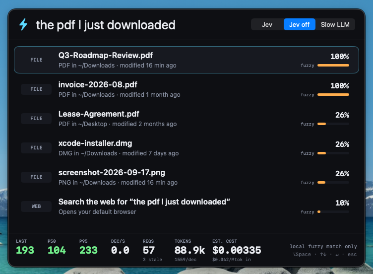

# Jev Launcher

A Spotlight-style launcher for macOS that puts an LLM judgment in the keystroke loop. Press ⌥Space, start typing, and on **every keystroke** the panel sends the query plus local context and the top local candidates to [Jev](https://docs.typesafe.ai) in one fan-out request. Jev answers three typed questions (intended target, intended action kind, "is this unambiguous enough to run on Enter?"), the list re-ranks live, and the top hit shows Jev's probability. Enter runs it.


The recording above is one uninterrupted session against the live API: 57 requests, median round-trip **104 ms**, p95 **233 ms**, three stale answers discarded, $0.0034 total.

## Why speed matters

A launcher is judged per keystroke. Anything above ~200 ms feels like lag, which is why nobody puts a general LLM (2–4 s) between the keyboard and the results list. Jev returns a full three-question judgment in about 100 ms on this VM, so the list can re-rank on every character with **no debounce**: the app fires a request per keystroke, tags each with a sequence number, applies whatever comes back newest-first and drops the rest. The footer shows the round-trip live: last / p50 / p95 ms, decisions per second, request and stale counts, tokens, and the running cost estimate.

## Measured numbers

All figures are from real runs on this macOS VM (macOS 26.5, ARM64, Xcode 26.6) against `jev-latest`, which resolved to `jev-1.13.0`.

| Metric | Value | Where measured |
|---|---|---|
| Median round-trip (p50) | **104 ms** | footer after the 57-request demo session (`docs/query-sleep.png`) |
| p95 round-trip | 233 ms | same session |
| Fastest / slowest observed | 78 ms / ~500 ms (first request, cold TLS) | footer during the sessions in `docs/` |
| Requests in the demo session | 57 (one per keystroke, five queries, 3 stale discarded) | `docs/query-sleep.png` |
| Decisions per second while typing | 3.7–4.6 | footer (`docs/query-pdf.png`); bounded by human typing speed, not by Jev |
| Input tokens per decision | ~1,550 (`state` with up to 15 candidates + 3 questions) | footer, from `usage.input_tokens` |
| Output tokens | 0 | `usage.output_tokens` is always 0 for typed judgments |
| Cost per decision | $0.000065 | 1,550 × $0.042 / 1M input tokens (output is free per the pricing docs) |
| Cost of the 57-request demo | $0.00335 | footer |

Every question in the request comes back in the same round-trip, so "three judgments per keystroke" costs the same latency as one.

### The five ambiguous queries

Each screenshot is the live panel after typing the query at human speed (~90 ms per character). The top hit is correct in every case and Jev marks it `READY`.

| Query | Top hit | Jev target probability | Screenshot |
|---|---|---|---|
| `dark` | Toggle Dark Mode | 99% |  |
| `wifi off` | Turn Wi-Fi Off (not "Turn Wi-Fi On", which has the same fuzzy score) | 100% |  |
| `calc 15% of 240` | `= 36` (code-evaluated; Calculator.app is 2nd) | 95% |  |
| `the pdf I just downloaded` | `Q3-Roadmap-Review.pdf` (modified 16 min ago) over two older PDFs, a DMG and a PNG | 100% |  |
| `sleep` | Sleep | 99% |  |

### Baseline: Jev off

The `Jev off` segment switches to pure local fuzzy matching so the difference is visible on the same query. For `the pdf I just downloaded` the fuzzy matcher scores two PDFs identically at 100% and only wins the tie by list order; there is no `READY` signal because nothing in the fuzzy score says whether the intent is settled.



`Slow LLM` is the third segment: identical Jev judgments, but applied 2.5 s after each keystroke to simulate a conventional LLM round-trip. Type at normal speed and the list is always ranking the query from two or three words ago.

## How the Jev questions are designed

One request per keystroke (`POST /v1/systemone`, `model: jev-latest`). Jev never generates text; it only picks among options the code supplies. Everything else — indexing, fuzzy prefiltering, arithmetic, execution — is plain Swift.

**State** (`Sources/JevQuestions.swift`):

```json
{
  "query": "the pdf I",
  "query_note": "Text the user has typed so far into a Spotlight-style macOS launcher. It is often an incomplete prefix or a short natural-language phrase.",
  "context": { "frontmost_app": "Finder", "recent_apps": ["Finder", "Safari"], "clipboard_kind": "text", "time_of_day": "afternoon", "weekday": "Thursday" },
  "candidates": [
    { "id": "c0", "kind": "open_file", "title": "Q3-Roadmap-Review.pdf", "detail": "PDF in ~/Downloads · modified 16 min ago" },
    { "id": "c1", "kind": "open_file", "title": "invoice-2026-08.pdf", "detail": "PDF in ~/Downloads · modified 1 month ago" },
    { "id": "c6", "kind": "web_search", "title": "Search the web for “the pdf I”", "detail": "Opens your default browser" }
  ]
}
```

Candidates are the top 13 fuzzy matches from the local index plus synthetic entries (an arithmetic result when the query parses, and a web search for any non-empty query), capped at 15. They carry short ids (`c0`…`c14`) that the code maps back to the real candidates when the answer arrives, so Jev only ever sees a dozen rows, never the whole index.

**Questions** (all three in one `questions` object):

1. `target` — **Choice** over `c0…cN` plus `none`. "Which entry in `candidates` is the item they intend to open or run? Treat `query` as a possibly incomplete prefix or paraphrase… Match on meaning." The full probability distribution is used, not just the argmax: each row's bar is `probabilities[cK]`.
2. `action` — **Choice** over `open_app`, `open_file`, `web_search`, `calculate`, `system_toggle`, `run_shortcut`, `unclear`, each with a one-line rubric. Used as a secondary ranking signal (a candidate whose `kind` matches the chosen action gets a boost) and shown in the footer.
3. `ready` — **Noul**. "The launcher is about to run the best-matching candidate the instant the user presses Enter. Is `query` already unambiguous enough for that?" with explicit yes/no criteria. Above 0.6 the top row gets the `READY ↵` badge and turns green.

**Ranking** is deterministic given the answer: `score = 0.65 · P(target) + 0.20 · P(action matches kind) + 0.15 · fuzzy`. Without an answer (Jev off, request failed, or nothing back yet) the score is just `fuzzy`, so the panel always has a sensible order and never waits on the network.

**In-flight handling**: every query change increments a sequence number and starts a `Task`. A response is applied only if its sequence is newer than the last one applied; otherwise it is counted as stale in the footer. While a newer request is in flight the previous judgment is kept, dimmed, so the list does not flicker back to fuzzy order between keystrokes.

**Iteration notes.** The `ready` wording went through several rounds against the five queries plus deliberately ambiguous ones, probed with a small `curl` harness outside the app. The first version ("is this unambiguous?") scored 0.3–0.4 even for `dark`. Telling Jev that `candidates` is the complete option set, that `web_search` is only a fallback, and giving one concrete example of a short-but-unambiguous prefix produced this spread with the final wording (one probe each, same candidate sets as the app):

| Query | Candidates | `ready` |
|---|---|---|
| `calc 15% of 240` | = 36, Calculator, web | 0.88 |
| `the pdf I just downloaded` | 3 PDFs of different ages, web | 0.84 |
| `dark` | Toggle Dark Mode, web | 0.64 |
| `da` | Toggle Dark Mode, Dashboard, web | 0.29 |
| `sle` | Sleep, Slack, web | 0.29 |
| `wifi` | Turn Wi-Fi Off, Turn Wi-Fi On, web | 0.16 |
| `s` | Sleep, Safari, Slack, web | 0.13 |

`wifi` alone is correctly not ready (on or off?) while `wifi off` is; `sle` is correctly torn between Sleep and Slack. The `target` question needed the explicit hint that `detail` carries recency ("the PDF whose `detail` says it was modified most recently") before "the pdf I just downloaded" reliably preferred the newest file over the alphabetically first one.

## What is local (code, not Jev)

- **Index** (`LocalIndex.swift`): `.app` bundles in `/Applications`, `/System/Applications`, `/System/Applications/Utilities`; files in `~/Downloads`, `~/Desktop`, `~/Documents` (top level + one nested level, capped at 400 per folder, with modification age in the subtitle); user Shortcuts from `shortcuts list`; nine system toggles.
- **System toggles** (`Executor.swift`): Dark Mode (AppleScript to System Events), Wi-Fi on/off (`networksetup -setairportpower`), Do Not Disturb (`x-apple.systempreferences:com.apple.Focus-Settings.extension`), Sleep (AppleScript), Lock Screen (`CGSession -suspend`), Empty Trash (AppleScript to Finder), Show/Hide hidden files (`defaults write` + `killall Finder`).
- **Calculator** (`Calculator.swift`): a recursive-descent parser for `+ - * / ^ ( )`, `x` as multiply, `sqrt`, percentages (`15% of 240`, `200 * 10%`), with an optional `calc`/`=` prefix. No `NSExpression`, no eval.
- **Fuzzy prefilter** (`Fuzzy.swift`): exact / prefix / word-initial / subsequence scoring over title and keywords with stopwords stripped.
- **Execution**: `NSWorkspace.open` for apps, files and web searches; the calculator result is copied to the clipboard.

## Run

Requirements: macOS 14+, Xcode 16+ (built with 26.6), [XcodeGen](https://github.com/yonaskolb/XcodeGen) 2.46.0 only if you change `project.yml`, and a TypeSafe API key.

```sh
cd jev-launcher
export TYPESAFE_API_KEY=...        # read from the environment; never hardcoded
./run.sh --show                    # builds Debug and launches with the panel open
```

`run.sh` execs the binary from the shell so the environment variable is inherited. If you launch the `.app` from Finder instead, the key is read from the Settings field (menu bar ⚡ → Settings…, stored in `UserDefaults` under `typesafeAPIKey`). With no key the panel still works as a fuzzy launcher and the empty state says `No TYPESAFE_API_KEY — Jev disabled`.

- **⌥Space** toggles the panel from anywhere (Carbon `RegisterEventHotKey`; no Accessibility permission needed).
- **↑ / ↓** move the selection, **↵** runs it, **esc** hides the panel.
- The menu-bar ⚡ item has Toggle Launcher, Settings… and Quit. The app has no Dock icon (`LSUIElement`). The index is rebuilt in the background each time the panel is shown.

### Permissions

- **Automation (Apple Events)** — the first Dark Mode, Sleep or Empty Trash toggle prompts "Jev Launcher wants to control System Events / Finder". `NSAppleEventsUsageDescription` is set in `project.yml`. The build is unsandboxed so it can read the folders it indexes.
- **Wi-Fi** toggling uses `networksetup`, which may ask for an administrator password on some macOS versions.
- Nothing else: no Accessibility, Screen Recording or Full Disk Access.

## Build and test

```sh
xcodebuild -project JevLauncher.xcodeproj -scheme JevLauncher -configuration Debug \
  -destination 'platform=macOS' -derivedDataPath build CODE_SIGNING_ALLOWED=NO build
xcodebuild -project JevLauncher.xcodeproj -scheme JevLauncher -configuration Debug \
  -destination 'platform=macOS' -derivedDataPath build CODE_SIGNING_ALLOWED=NO test
xcrun swift-format lint --strict --recursive Sources Tests
```

31 unit tests cover the calculator, fuzzy scorer, prefilter and ranker, request construction and response parsing, latency/cost statistics, recency phrasing, file candidates and Wi-Fi port parsing. None of them touch the network. See [TESTING.md](TESTING.md).

## Limitations

- **The list is always shown.** The brief asked whether intent is clear enough to execute "without showing a list". Hiding the list on a probabilistic signal felt wrong for a launcher, so the `ready` Noul is surfaced as the green `READY ↵` badge on the top row instead; Enter always runs the selected row regardless.
- **Latency is network-bound.** The numbers above are from a US VM; p50 will track your distance to `api.typesafe.ai`. The first request of a session pays TLS setup (~500 ms).
- **Fast typists generate stale answers.** Typing far faster than ~10 chars/s produces overlapping requests; the newest answer always wins, but the stale count climbs and p95 rises because the API is handling several requests at once. At human speed the stale count in the demo was 3 out of 57.
- **Context is minimal.** `frontmost_app`, `recent_apps`, `clipboard_kind`, `time_of_day` and `weekday` are sent; the app does not read window titles, browser tabs or clipboard contents.
- The files in the screenshots (`Q3-Roadmap-Review.pdf`, `invoice-2026-08.pdf`, …) are fixtures created in `~/Downloads` and `~/Desktop` on the VM so the PDF query had something realistic to disambiguate; TESTING.md recreates them.
- Shortcuts appear only if `shortcuts list` returns quickly; the index build runs in the background and the panel re-ranks when it lands.
