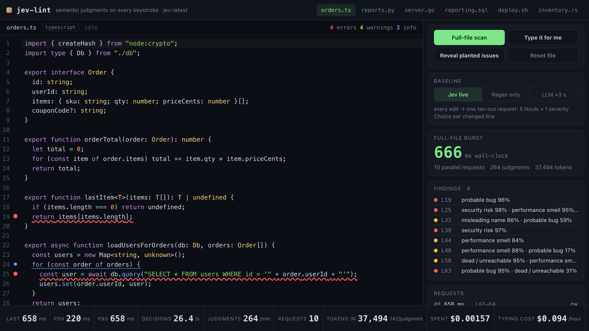
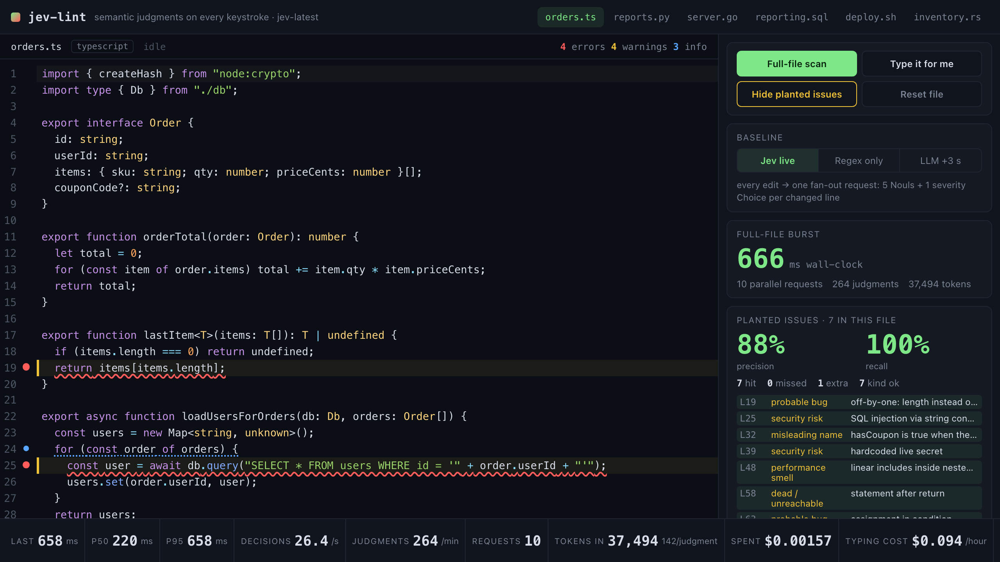
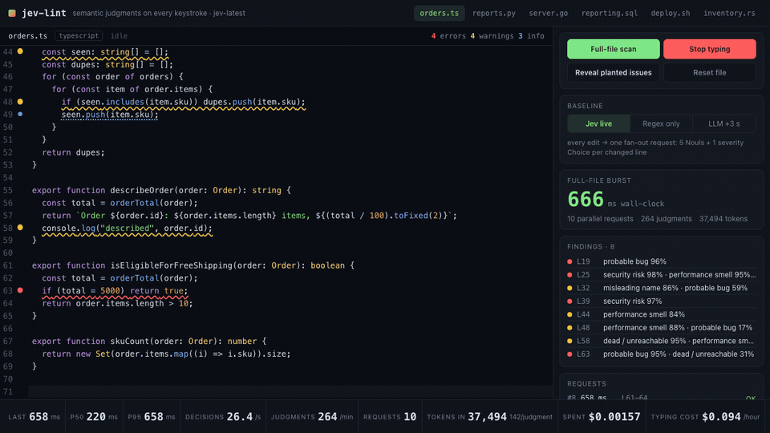
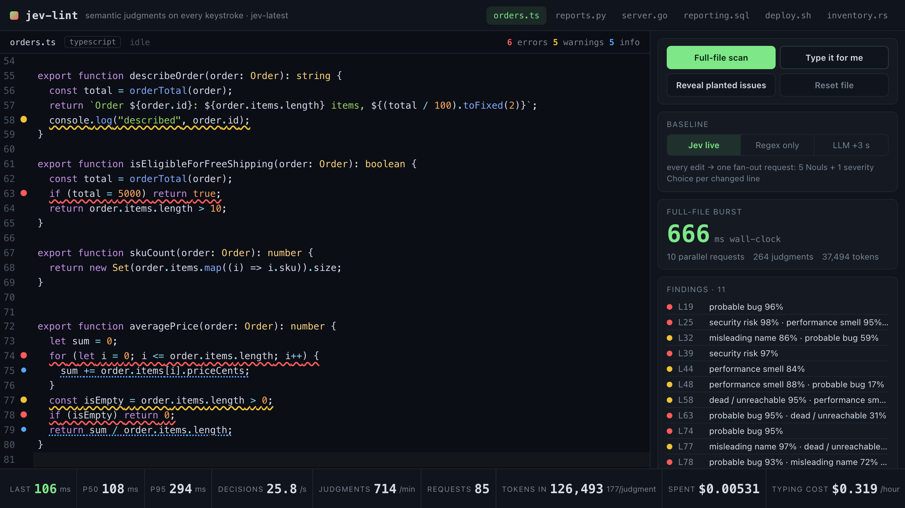

# jev-lint

A browser code editor that asks [Jev](https://docs.typesafe.ai) semantic questions about the line you are editing, on every keystroke, and turns the answers into gutter markers, squiggles and hover probabilities. Median round-trip in the runs recorded below was 108–157 ms per request, so a squiggle typically lands before the next word is typed.



## Why speed is the point

AI code review today runs on the pull request, or at best on save, because a generate-and-parse LLM pass takes seconds and a prompt per keystroke is unaffordable. Jev answers typed judgments (Noul = yes/no probability, Choice = one of N) over structured state instead of generating text, so one request carrying 30 independent questions about a function comes back in roughly the time of a network round-trip and costs a fraction of a cent per hour of continuous typing. That makes a *semantic* linter with the ergonomics of a syntax linter possible: it flags an off-by-one, a SQL string concatenation or a variable named `isEmpty` that is true when the list is full, while you are still on the line.

The status bar makes this measurable on screen: last / p50 / p95 request latency, decisions per second, judgments per minute, request count, input tokens (and tokens per judgment), spent so far and the projected cost of an hour of continuous typing. The **LLM +3 s** baseline holds the same Jev answers for three seconds so the difference is visible, and **Regex only** shows what a deterministic-only linter catches on the same files.

## What happens on a keystroke

```
editor change
  -> changedLines(prev, next)                              deterministic diff, 1-based line numbers
  -> enclosingFunction(extractFunctions(text, lang), n)    brace / indent / SQL-block aware, six languages
  -> buildRequest(...)                                     state + 6 questions per changed line, one request per function
  -> POST /api/jev  (Node proxy adds the key)  -> api.typesafe.ai/v1/systemone
  -> markersFromAnswers(refs, answers)                     thresholds -> Marker{line, severity, kinds[], ...}
  -> clusterMarkers(markers)                               demotes adjacent same-kind spillover to info
  -> CodeMirror setDiagnostics                             gutter dot + squiggle + hover
```

Code owns everything deterministic: parsing the enclosing function, numbering its lines, collecting declared/used identifiers, extracting imports, diffing, thresholds, clustering, metrics and the precision/recall math. Jev only receives the semantic questions.

Edits are throttled at 60 ms (never debounced longer than that). Requests overlap; every request carries a sequence number and a snapshot of each judged line's text, and an answer whose line has changed in flight is logged as `stale` and discarded. A line that already has a request in flight is not re-sent until that request lands (its answer would be stale by definition), then re-judged immediately. If a request fails, times out or is rate-limited twice, the changed lines fall back to a regex heuristic (`src/heuristics.ts`) so the editor never stalls or goes blank; fallbacks show as `heuristic` in the request log and count as failures in the status bar.

### State sent to Jev

```json
{
  "language": "typescript",
  "function_name": "averagePrice",
  "function_source": "72: export function averagePrice(order: Order): number {\n73:   let sum = 0;\n74:   for (let i = 0; i <= order.items.length; i++) {\n ...",
  "lines_under_review": [{ "line": 74, "text": "  for (let i = 0; i <= order.items.length; i++) {" }],
  "identifiers": { "declared": ["averagePrice", "order", "sum", "i", "isEmpty"], "used": ["Order", "items", "length", "priceCents"] },
  "file_imports": ["import { createHash } from \"node:crypto\";", "import type { Db } from \"./db\";"]
}
```

### Questions per changed line (one fan-out request per function)

| id | type | asks | criteria (abridged) |
|---|---|---|---|
| `probable_bug` | noul | logic error that would make the program behave incorrectly at runtime | true: off-by-one, assignment as comparison, inverted condition, unhandled null/nil, missing error check; false: does what surrounding code expects |
| `security_risk` | noul | introduces a vulnerability | true: SQL/shell/HTML/path injection from untrusted input, eval, hardcoded secret, insecure randomness, disabled TLS; false: risky-looking API with constant input |
| `misleading_name` | noul | an identifier declared/assigned on the line contradicts what it holds | true: `isEmpty = items.length > 0`; false: vague or short names |
| `dead_or_unreachable` | noul | can never execute or never affect the program | true: after unconditional return/exit, always-false guard, never-read assignment |
| `performance_smell` | noul | avoidable performance problem | true: query in a loop (N+1), quadratic search, recomputation in a loop; false: data known to be tiny |
| `severity` | choice | `ignore` / `info` / `warning` / `error` | error = definite bug or security hole, warning = likely defect, info = stylistic, ignore = nothing wrong |

Each question names the specific `lines_under_review[i]` and tells Jev to read it in the context of `function_source`, so multiple changed lines in one function share a single request. The exact wording is in `src/markers.ts` (`questionsForLine`); it was iterated against the planted issues below.

### Mapping answers to markers

- A Noul at or above **0.60** raises a marker on its own; the strongest kind becomes the headline.
- Otherwise a `warning`/`error` severity Choice with confidence at or above **0.55** raises a marker if any Noul is at least 0.15.
- The Choice sets the severity; `ignore` with a very strong Noul (>= 0.85) still shows as a warning, and `info` with a very strong Noul is promoted to warning.
- Jev tends to spread a strong signal over the neighbouring lines of the same construct (the `for` header and its body, an `if` and its `return`). `clusterMarkers` keeps the strongest of adjacent same-kind Jev markers and demotes the rest to `info`, which is what most of the blue dots in the screenshots are.

## Run

```sh
cd jev-lint
npm ci
cp .env.example .env         # or export TYPESAFE_API_KEY in your shell
npm run dev                  # http://localhost:5173 — Vite middleware proxies /api/jev
```

Production build: `npm run build && TYPESAFE_API_KEY=... npm run preview` serves `dist/` and `/api/jev` from `server.mjs` on port 4173 (`PORT` overrides). The key is read from the environment by the Node process only; the browser never sees it, and the proxy forwards `retry-after` so the client's single bounded retry on `429` works. Node 22.12+ or 24.

Controls: file tabs (six samples), **Full-file scan** (every judgeable line of the file in one parallel burst, wall-clock shown), **Type it for me** (types a buggy function character by character into the current file), **Reveal planted issues** (highlights the seeded lines and shows live precision/recall against the current markers), **Reset file**, and the baseline switch (**Jev live** / **Regex only** / **LLM +3 s**), which rescans the file in the selected mode.

## Measured numbers

All numbers below are from real runs against `jev-latest` (`jev-1.13.0` in responses) from a machine in the US on 2026-09-17, captured by the Playwright golden-path script that also took the screenshots and by `scripts/evaluate.ts`.

### Latency, throughput, cost

| Scenario | last | p50 | p95 | decisions/s | requests | tokens in | tokens/judgment | spent | projected typing cost |
|---|---|---|---|---|---|---|---|---|---|
| Full-file scan of `orders.ts` (264 judgments, 10 parallel requests) | 322 ms | 134 ms | 322 ms | 26.4 | 10 | 37,494 | 142 | $0.00157 | $0.094 / hour |
| Same scan, second run | 658 ms | 220 ms | 658 ms | 26.4 | 10 | 37,494 | 142 | $0.00157 | $0.094 / hour |
| After the 30 s "Type it for me" demo (continuous typing, 85 requests, 0 failures) | 106 ms | 108 ms | 294 ms | 25.8 | 85 | 126,493 | 177 | $0.00531 | $0.319 / hour |

Burst wall-clock for judging a whole file (every function, all requests in parallel): 330 ms and 666 ms for `orders.ts` in the two browser runs above; 179–749 ms across the six samples in the evaluation script runs. The p50 of a single request was 105–163 ms per file in those runs, p95 up to about 450 ms, with occasional single requests in the 600–750 ms range. Two separate 30 s typing sessions produced 83–130 requests each; per-keystroke cost is dominated by the function source resent with each request (140–190 input tokens per judgment).

Cost uses the documented TypeSafe price of $42 per billion input tokens with output tokens free, computed from `usage.input_tokens` in every response.

### Precision / recall on the planted issues

Each sample carries 6–7 planted issues marked in the source (`⟦kind|note⟧`, stripped before display). A marker on a planted line at `warning` or `error` is a true positive; a `warning`/`error` marker on any other line is a false positive; `info` markers are not counted as flags. "Kind ok" means the headline kind also matched the planted kind. Two consecutive full runs of `scripts/evaluate.ts`:

| File | Planted | Run 1 P / R | Run 2 P / R | Burst wall-clock (run 1 / 2) | p50 request |
|---|---|---|---|---|---|
| TypeScript `orders.ts` | 7 | 88% / 100% | 86% / 86% | 449 / 749 ms | 147 ms |
| Python `reports.py` | 7 | 100% / 71% | 100% / 71% | 425 / 214 ms | 163 ms |
| Go `server.go` | 7 | 86% / 86% | 86% / 86% | 458 / 179 ms | 105 ms |
| SQL `reporting.sql` | 6 | 83% / 83% | 83% / 83% | 289 / 184 ms | 119 ms |
| Bash `deploy.sh` | 6 | 86% / 100% | 86% / 100% | 324 / 323 ms | 146 ms |
| Rust `inventory.rs` | 7 | 100% / 100% | 100% / 86% | 357 / 412 ms | 125 ms |
| **Overall** | **40** | **90% / 90%** | **90% / 85%** | | |

In the browser the same TypeScript file scored 86% / 86% and 88% / 100% in two scans (screenshot below). The recurring misses and false positives are:

- `except Exception: pass` in Python (swallowed error) and `WHERE u.id NOT IN (SELECT o.user_id ...)` in SQL (NULL semantics) are usually not flagged at all.
- `hasCoupon = code === undefined` (TS), `in_stock = item.qty == 0` (Rust) and `os.path.join(base_dir, name)` (Python path traversal) frequently come back with a strong Noul but a severity Choice of `info`, so they show as blue info dots rather than counted flags.
- In Go, `if err == nil { return 0, err }` is planted on the `if` line but Jev puts the error on the `return` line, which counts as one miss plus one false positive.
- `const seen: string[] = []` in TS and `WHERE o.created_at > now() - interval '1 year'` in SQL are the most common genuine false positives.

Run-to-run variance is normal: Noul probabilities near a threshold flip between runs. Python is the most variable file; an independent browser run measured 100% / 57% (L20, L24 and L53 all came back as info or unflagged).



## Type it for me



The demo inserts a new function at the end of the file at 38 ms per character with a pause at each line end. Squiggles appear on the `for (let i = 0; i <= order.items.length; i++)` header, `isEmpty`, and `if (isEmpty) return 0;` while later lines are still being typed.



## Tests

`npm test` runs 46 Vitest tests with no network: function extraction across the six languages, changed-line diffing, identifier/import collection, request fan-out shape, answer-to-marker thresholds, clustering, precision/recall math, heuristics, metrics, and a `Linter` with a mocked `fetch` covering stale-answer discard, in-flight coalescing, the single `429` retry, heuristic fallback and the full-scan burst. See [TESTING.md](TESTING.md).

## Limitations

- Function extraction is heuristic (brace matching, Python indentation, `$$` blocks for SQL, `()` for Bash). It is right on the samples and typical code, but a function it cannot bound falls back to a fixed window around the changed line.
- The per-line framing means issues that live across lines (a value validated on one line and misused ten lines later) are judged only through the function context and are less reliable.
- Everything typed goes to the TypeSafe API through your own proxy. Do not point it at code you cannot send to a third party.
- The TypeSafe API rate-limited sustained bursts of well over 100 requests a minute during development. The client retries once, then falls back to heuristics; the request log in the sidebar shows when that happens.
- Screenshots were captured headlessly with Playwright at 1280 x 720 (2x scale); the GIF is 4 frames per second, so it under-represents how quickly markers land.
