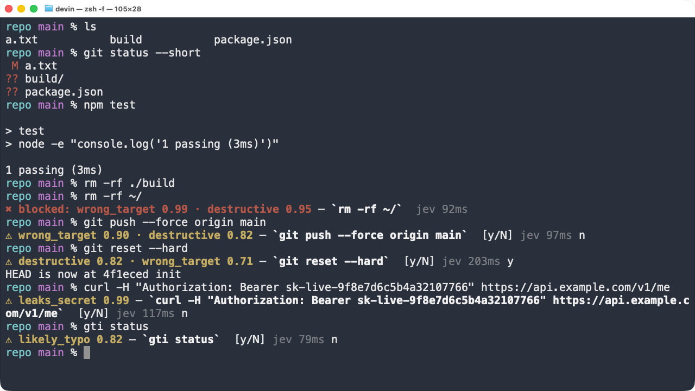
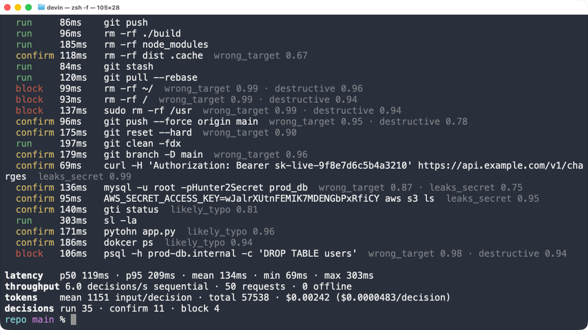
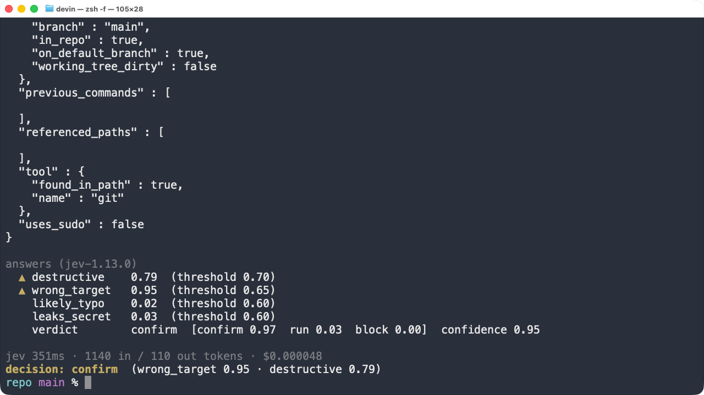

# jev-shell-guard

`jevsh` is a compiled Swift command-line tool plus a zsh `accept-line` hook. Every command you
press Enter on is judged by [Jev](https://docs.typesafe.ai) *before it runs*. Safe commands run
with no output at all; risky ones get a one-line confirm; catastrophic ones are refused.



Animated version of the same session: [screenshots/demo.gif](screenshots/demo.gif).

## Why this needs Jev

A safety check in the hot path of every shell command has a latency budget of roughly one
keystroke. Jev answers five typed questions about a structured description of the command in
about 100–200 ms end to end (measured below), so the check is invisible on `run`. A general LLM
at 2–4 s per call would make the shell unusable; a regex list alone cannot tell
`rm -rf ./build` from `rm -rf ~/` or `git reset --hard` on a clean tree from a dirty one.

## What gets sent

`jevsh` builds one JSON `state` object per command (code, not the model, computes all of it):

```json
{
  "command": "git reset --hard",
  "cwd": "/Users/devin/jevsh-demo/repo",
  "git": { "in_repo": true, "branch": "main", "on_default_branch": true, "working_tree_dirty": true },
  "referenced_paths": [ { "raw": "./build", "path": "…/repo/build", "exists": true, "is_directory": true,
                          "is_home_or_root": false, "inside_cwd": true } ],
  "tool": { "name": "git", "found_in_path": true },
  "uses_sudo": false,
  "has_token_like_argument": false,
  "previous_commands": ["ls", "git status --short", "npm test"]
}
```

The zsh hook contributes what only the shell knows: the last three history entries and whether
the first word resolves to a command, alias, builtin or function (`whence -w`), after skipping
wrappers such as `sudo`, `env`, `time` and `VAR=value` prefixes.

## The five questions (one request)

All five are asked in a single `POST /api/alpha/decisions` call; the answers are independent.

| id | type | asks |
|---|---|---|
| `destructive` | noul | Will this irreversibly destroy data a developer cares about? Regenerable artifacts (build, caches, `node_modules`) are explicitly *not* destructive. |
| `wrong_target` | noul | Is a mutating operation aimed at `~`, `/`, a system path, a non-existent path, a prod host, or a history rewrite while on main/master? Plain commit/push/pull on main is fine. |
| `likely_typo` | noul | Is the program or a flag misspelled so the command will just error? A correctly spelled tool that is merely not installed is not a typo (`tool.found_in_path` is in the state for this). |
| `leaks_secret` | noul | Does the command inline a credential that will land in shell history? |
| `verdict` | choice | `run` / `confirm` / `block`, with criteria that mirror the policy below. |

The wording was tuned against live answers. Two changes that mattered: `likely_typo` originally
fired on `docker ps` when Docker was not installed (fixed by stating that unavailable ≠
misspelled), and `wrong_target` originally fired on a plain `git push` on main (fixed by listing
"ordinary commit/push/pull on main" under *false*).

## Policy (code, deterministic)

```
reasons  = nouls above their thresholds, sorted by probability
if no reason fires:
  confirm  if verdict == block with P(block) ≥ block_verdict_probability (0.60)   # never block on the Choice alone
  run      otherwise
else:
  block    if verdict == block with P(block) ≥ 0.60,
           or destructive ≥ block_threshold AND wrong_target ≥ block_threshold (0.90)
  confirm  otherwise
```

Defaults live in `Config.default` and can be overridden in `~/.config/jevsh/config.json`
(partial files are fine, unknown keys are ignored):

```json
{
  "deadline_ms": 400,
  "thresholds": { "destructive": 0.70, "wrong_target": 0.65, "likely_typo": 0.60, "leaks_secret": 0.60 },
  "block_threshold": 0.90,
  "block_verdict_probability": 0.60,
  "skip_tools": ["ls", "cd"]
}
```

`jevsh config` prints the effective configuration.

## UX

- `run`: nothing is printed and the command executes as if the hook did not exist.
- `confirm`: `⚠ destructive 0.82 · wrong_target 0.71 — `git reset --hard`  [y/N] jev 174ms`.
  Typing `y` runs the command; anything else leaves the line in the editor so you can fix it.
- `block`: `✖ blocked: wrong_target 0.99 · destructive 0.95 — `rm -rf ~/`  jev 92ms`. The line is
  cleared (and kept in history so you can recall and edit it).
- The Jev round-trip is printed dim at the end of every banner.
- `JEVSH_DISABLE=1` bypasses the hook for a session. Commands starting with `jevsh` are never judged.

## Offline / deadline

Each check is a fresh process with a hard deadline (`deadline_ms`, default 400). If the API
key is missing, the request errors, returns non-2xx, fails to parse, or misses the deadline, the
in-flight request is cancelled and a small regex denylist decides instead
(`Sources/JevShellGuard/Fallback.swift`: root/home deletion, disk writes, fork bombs,
force pushes, hard resets, `DROP TABLE`, inline tokens, unavailable tools, …). When the fallback
escalates, a dim `jev offline (http 429 rate limited) — regex fallback` line precedes the banner
and the banner ends with `jev offline` instead of a latency. When the fallback says run, nothing
is printed. The shell never waits longer than the deadline.

## Measured numbers

Real `jevsh bench` run (50 varied commands, sequential, one process per command, from a macOS
VM to `openrouter.ai`; model `jev-1.13.0`):

```
latency    p50 119ms · p95 209ms · mean 134ms · min 69ms · max 303ms
throughput 6.0 decisions/s sequential · 50 requests · 0 offline
tokens     mean 1151 input/decision · total 57538 · $0.00242 ($0.0000483/decision)
decisions  run 35 · confirm 11 · block 4
```



Cost uses the published Jev price of $0.042 per million input tokens (output tokens are free).
An earlier run of the same bench measured p50 102 ms / p95 151 ms / mean 114 ms; expect the
p50 to sit around 100–120 ms from a US machine. The interactive session in the screenshot above
shows per-command latencies of 79–203 ms.

`jevsh bench --heuristic` runs the same 50 commands through the regex fallback only, as the
"before" baseline (sub-millisecond, but it can only see literal patterns). `jevsh stats` prints
the same summary over every real check since install (`~/.local/state/jevsh/stats.jsonl`).

`jevsh explain "<cmd>"` prints the state, all raw probabilities, tokens and cost:



## Install

Requires macOS 14+, Xcode 16+ command-line tools (Swift 5.9+), zsh, and `OPENROUTER_API_KEY`
exported in your shell.

```sh
cd jev-shell-guard
./install.sh          # swift build -c release, copy to ~/.local/bin, append guarded source line to ~/.zshrc
exec zsh
```

`install.sh` honours `JEVSH_BIN_DIR`, `JEVSH_SHARE_DIR` and `JEVSH_ZSHRC` if you want to
install somewhere else. Uninstall by deleting `~/.local/bin/jevsh`, `~/.local/share/jevsh` and
the two `jevsh` lines in `~/.zshrc`.

## Layout

```
Package.swift
Sources/JevShellGuard/   library: CommandState, Questions, Policy, Fallback, JevClient, GitProbe, Stats, Banner
Sources/jevsh/main.swift CLI: check / explain / bench / stats / config
Tests/JevShellGuardTests state construction, policy with fixture answers, fallback, stats, banner (no network)
jevsh.zsh                zle accept-line hook
install.sh
screenshots/
```

## Limitations (observed)

- Each command is a fresh process, so there is no connection reuse; the first request after a
  pause can hit ~300 ms (TLS). p95 is dominated by this.
- Jev's judgment is probabilistic. In the bench, `git clean -fdx` and `sl -la` (typo for `ls`,
  but `sl` is also a real program) came back `run`, and `rm -rf dist .cache` sat right at the
  `wrong_target` threshold (0.67) once. Thresholds are there to be tuned per user.
- Only the first simple command of a line is inspected for the tool name; pipelines and `&&`
  chains are sent whole as text, so Jev sees them but path/tool probing covers the first
  segment.
- The hook is zsh-only (it replaces the `accept-line` widget). Bash `preexec` cannot cancel a
  command without a wrapper, so it was not attempted.
- The TypeSafe API rate limit was hit once while running the automated demo and the bench back
  to back; the hook fell through to the regex list and printed `jev offline (http 429 rate limited)`
  as designed.
