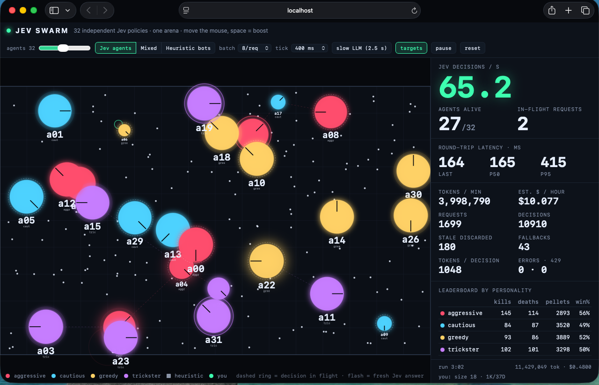
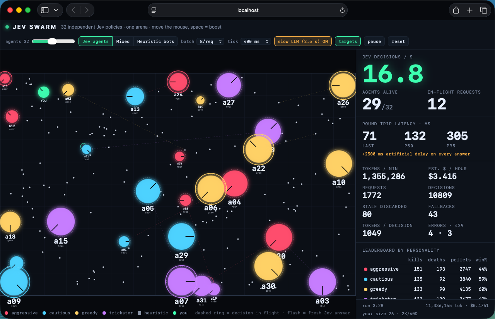
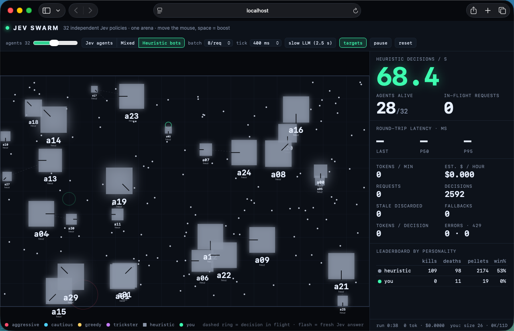

# jev-swarm

32 autonomous agents in one `.io`-style arena, each piloted by its own [Jev](https://docs.typesafe.ai) policy. Every ~400 ms each agent sends only its local perception and gets back three typed judgments: which way to move, whether to spend its boost, and which entity to pursue. Physics, collisions, eating, respawns and the arena rules run in code; Jev supplies dozens of independent decisions per second. A human agent (mouse + space) plays in the same arena.



## Why speed matters here

A swarm of independent policies only works if the round trip is far shorter than the time an agent can afford to keep executing a stale decision. At ~165 ms median latency and 400 ms decision ticks, an agent is never more than one tick behind the world. The same architecture with a 2.5 s "typical LLM" round trip (the `slow LLM` toggle) collapses to ~19 decisions/s with all 12 request slots saturated, and agents run into walls and bigger neighbours because they act on perceptions that are several body-lengths old.

Cost is the other half: input tokens are the only thing billed, so a compact perception (~1,000 tokens per agent-decision) keeps a 32-agent swarm around $10/hour at 65 decisions/s.

## Run

Node 22.12+ or 24. The key stays server-side: the browser only ever calls `/api/jev`.

```sh
cd jev-swarm
npm ci
cp .env.example .env         # or: export TYPESAFE_API_KEY=...
npm run dev                  # http://localhost:5173
```

Production build: `npm run build && npm run preview` serves `dist/` on http://localhost:4173 (`PORT` to change) and proxies `/api/jev` through `server.mjs` using the same `jev-proxy.mjs` handler the Vite dev middleware uses.

Controls:

- **agents** slider (4–64, resets the world), **Jev agents / Mixed / Heuristic bots** policy, **batch** (agents per request), **tick** (decision interval).
- **slow LLM (2.5 s)** adds 2.5 s to every answer after it arrives — the before/after comparison.
- **targets** draws each agent's chosen target; **pause**, **reset** (same seed, identical world).
- Move the mouse to steer the green human agent, space to boost.

The world is seeded (`seed: 7`), so the spawn layout is identical on every reset; only Jev's answers and network timing vary.

## How the Jev questions are designed

Jev does not generate text, so all rules, physics and lookups live in code and the model only makes narrow typed judgments over well-structured state. One HTTP request carries up to 8 agents (fan-out): the `state` has the arena `rules` and the four `personalities` once, then one compact text perception per agent under `agents.<id>`:

```
you: cautious, size 30, energy 50%, boost cooling down (3.2s), heading E
nearby agents:
  a07: bigger, size 50, 30px E, moving W (toward you)
  a12: smaller, size 18, 140px SW, moving S
pellets: p019 62px N, p044 118px NE, ...
walls px: N 200, S 800, E 1500, W 100
```

Each agent gets three questions namespaced `<id>.move`, `<id>.boost`, `<id>.target`, whose instructions reference the agent's own JSON path and personality (`agents.a07`, `personalities.cautious`):

| question | type | criteria |
| --- | --- | --- |
| `move` | Choice over `N NE E SE S SW W NW hold` | each direction is described concretely from the perception: `toward a07 (BIGGER, 30px)`, `away from a07 (BIGGER)`, `pellet p019 62px`, `WALL 40px`, or `open` |
| `boost` | Noul | true: boost ready and a bigger agent approaching within ~150 px, or prey/pellet in burst reach and the personality spends boost on it; false otherwise |
| `target` | Choice over nearby smaller/similar agent ids, pellet ids, `none` | each option labelled with relation, distance and direction |

Answers are gated in code (`src/decide.ts`):

- `move` is applied only if its confidence is ≥ 0.12 (just above uniform over 9 options); if the agent also picked a prey target and gave the direction toward that prey ≥ 0.3 of the probability mass, the move snaps to the prey direction.
- `boost` fires when the noul ≥ 0.6 and the boost is actually ready (code enforces the 8 s cooldown regardless).
- Every 1/60 s tick `refineHeading` re-aims an agent at its chosen target as the target moves, as long as that stays within 45° of Jev's move — the tracking stays in code, the tactical choice stays with Jev.

Asynchrony (`src/swarm.ts`): every request carries the agents' sequence numbers; an answer with `seq <= agent.decision.seq` is discarded as stale. An agent keeps executing its last decision while the next request is in flight (max 2 per agent, 12 per page). If no fresh answer arrives for 4 s the deterministic heuristic takes over and the fallback is counted. Errors and 429s never stall the arena: the agent keeps its last decision and the scheduler backs off briefly (honouring `Retry-After` when present).

The heuristic bots (`heuristicDecision`) flee the nearest bigger agent within 180 px, otherwise chase the nearest edible one within 220 px, otherwise go to the nearest pellet, and boost when a threat is within 100 px or prey within 120 px. They are drawn as grey squares so the behaviour difference is visible in **Mixed** mode.

## Measured run

Live `jev-1.13.0` via `api.typesafe.ai`, Safari on macOS on the same machine as the proxy, defaults (32 Jev agents + human, 8 agents/request, 400 ms tick), captured at 3:02 of run time (screenshot above):

| metric | value |
| --- | --- |
| Jev decisions / s (60 s window) | 65.2 |
| requests | 1,699 |
| decisions applied | 10,910 |
| latency last / p50 / p95 | 164 / 165 / 415 ms |
| tokens / decision | 1,048 input |
| tokens / min | 3,998,790 |
| est. $ / hour | $10.08 (at $0.042 per Mtok input, output free) |
| total | 11,429,049 input tokens · $0.48 |
| stale answers discarded | 180 |
| heuristic fallbacks | 43 |
| errors · 429 | 0 · 0 |

Leaderboard at that moment (win% = kills / (kills + deaths)):

| personality | kills | deaths | pellets | win% |
| --- | --- | --- | --- | --- |
| aggressive | 145 | 114 | 2,893 | 56% |
| cautious | 84 | 87 | 3,520 | 49% |
| greedy | 93 | 86 | 3,889 | 52% |
| trickster | 102 | 101 | 3,298 | 50% |

An earlier 2:03 run with an identical configuration measured 59.8 decisions/s, p50 158 ms, p95 404 ms, 1,173 requests, 7.64 M input tokens, $0.32. A 40-request concurrency probe from Node returned all 200s in ~610 ms total.

Comparison modes:



*`slow LLM (2.5 s)` on: throughput drops to ~19 decisions/s with every request slot occupied, and agents die running into threats they perceived two and a half seconds ago.*



*`Heuristic bots`: the same arena driven by the greedy code policy — no requests, no tokens, uniformly grey square agents for comparison.*

## Limitations

- Screenshots were taken manually in Safari; there is no automated browser test. The behaviour differences between personalities are visible (aggressive agents hunt and lead the kill table, cautious/greedy ones collect the most pellets) but are not statistically evaluated beyond the leaderboard.
- Rate limits on `api.typesafe.ai` are dynamic. Bursts of more than ~4–5 requests per second occasionally return 429 (documented as a tokens-per-second bucket); the app treats these as "keep the last decision and back off", which shows up as fallbacks if the pause lasts longer than 4 s. The measured run above had none; earlier runs of the same length saw a handful.
- At 64 agents the request rate doubles; a `1000 ms` tick or `16/req` batch keeps the request rate in the range measured above.
- Cost is computed from `usage.input_tokens` and the published `jev-1.13` price; if pricing changes, `USD_PER_INPUT_TOKEN` in `src/metrics.ts` is the single constant to update.
