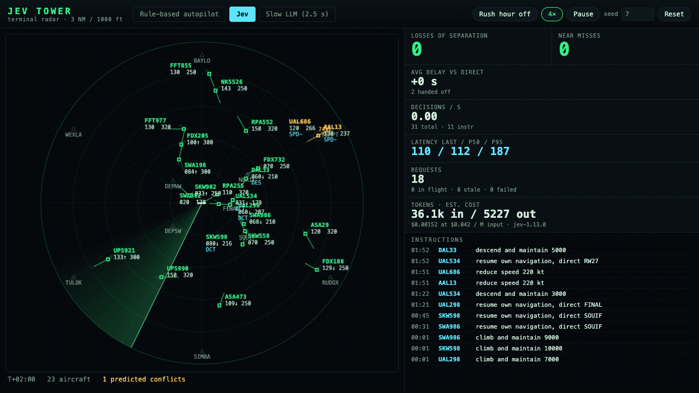
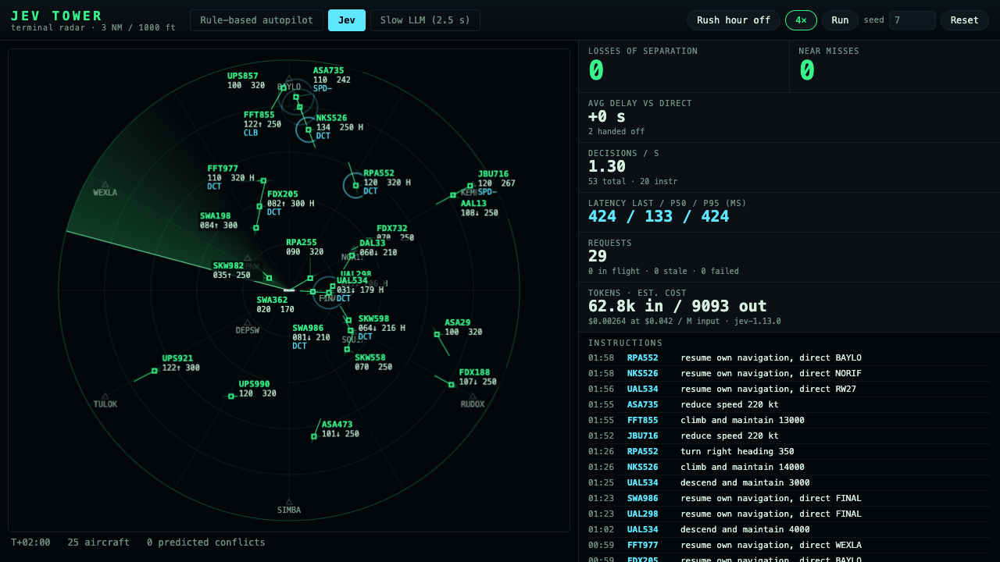
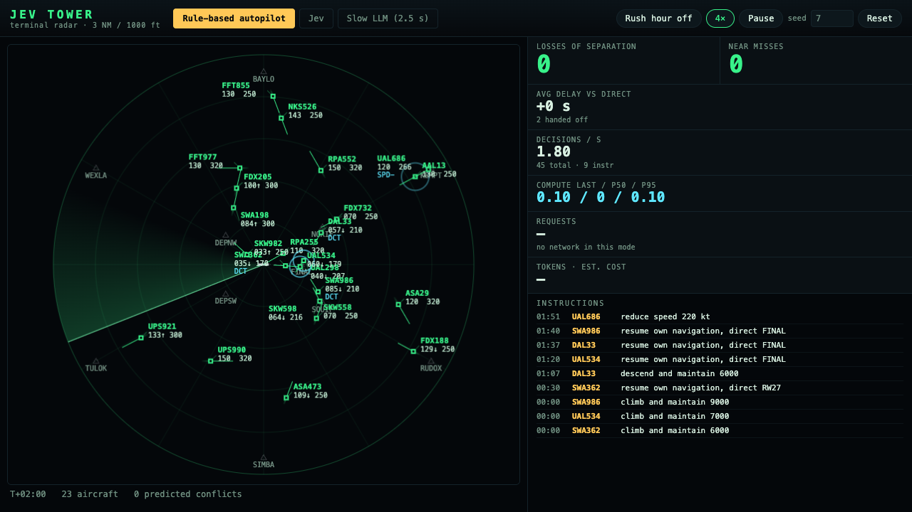
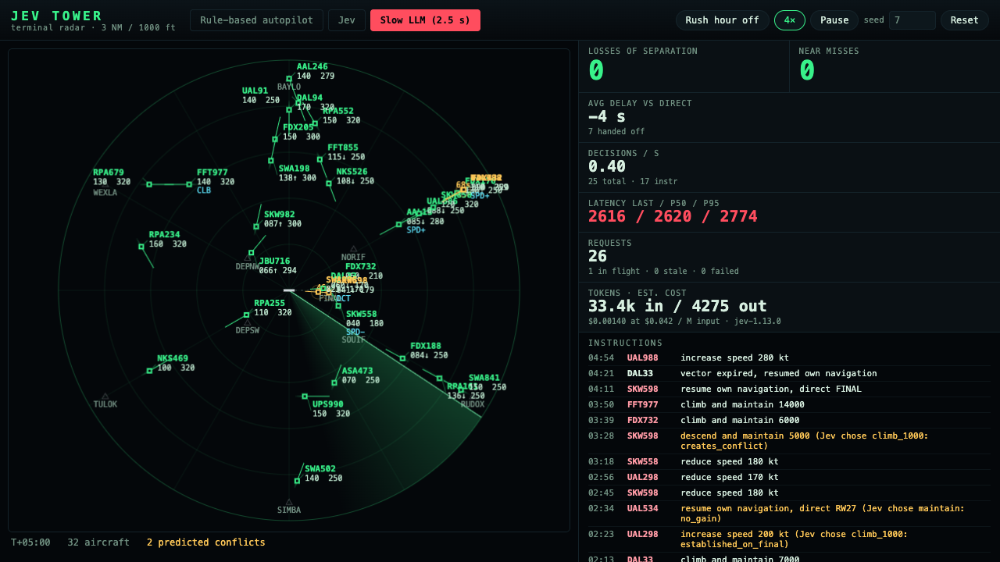

# Jev Tower

A browser radar scope for a busy terminal area where **Jev** (TypeSafe's System One model) is the radar controller. Fifteen to forty aircraft (arrivals, departures, overflights) fly seeded, reproducible traffic through a 50 NM sector with a runway, named fixes and a 3 NM / 1000 ft separation standard. Code predicts every conflict 120 s ahead; Jev decides, per aircraft, which single instruction to issue; code validates and flies it.



## Why speed is the whole point

A conflict that is 60 s from a loss of separation at 500 kt of closure leaves a controller a few seconds to decide. Every decision here is a network round-trip, so latency is part of the control loop, and the scope makes it visible: last / p50 / p95 request latency in ms, decisions per second, request count, tokens and estimated cost update live in the header.

Three control policies share the same simulation, prediction, validation and fallback code and differ only in who decides and how late the answer arrives:

| Mode | Who decides | Latency |
| --- | --- | --- |
| **Rule-based autopilot** | Deterministic geometry (`src/rules.ts`) | none |
| **Jev** | One batched Jev request per tick for every aircraft that has a predicted conflict or a pending clearance | measured live, ~100 ms p50 from this machine |
| **Slow LLM (simulated 2.5 s)** | The same Jev judgment, but one aircraft per call, most urgent first, with 2.5 s added to each answer, the shape of a chat-LLM agent loop | ~2.6 s |

Slow mode does not stall the UI. It simply answers late, so the queue of aircraft that need a decision grows, answers for aircraft whose situation has moved on are discarded as stale, and when traffic is dense enough an instruction arrives after the geometry has closed and separation is lost.

## Run

Node 22.12+ or 24. The TypeSafe key stays on the server: the browser only ever calls same-origin `/api/jev`, which a tiny Node proxy (`jev-proxy.mjs`, used by both the Vite dev middleware and `server.mjs`) forwards to `https://api.typesafe.ai/v1/systemone` with the `Authorization` header added server-side. The key is never logged or bundled.

```sh
cd jev-tower
npm ci
export TYPESAFE_API_KEY=...        # see .env.example
npm run dev                        # http://localhost:5173
```

Production: `npm run build && npm run preview` serves `dist/` and the proxy on port 4173 (`PORT` to override).

Controls, top left: **Rules / Jev / Slow** policy, **Rush hour** (doubles spawn rate), **1x / 4x**, **Pause**, **Seed** (deterministic traffic; type a number and press Reset). Switching policy or seed resets the sector and the telemetry.

## What is on the scope

- Range rings at 10 NM, runway 27 with its final approach course, the six sector entry/exit fixes and the two initial approach fixes.
- A sweep line; aircraft symbols coloured by phase (arrival, departure, overflight) with history trails and one-minute velocity vectors.
- Data blocks: callsign, altitude in hundreds of feet with climb/descent arrow, groundspeed and the current instruction. Block placement searches ten offsets to keep dense groups readable.
- Predicted-conflict lines with a countdown to loss of separation; aircraft in conflict turn amber and get a 1.5 NM ring, aircraft inside the standard turn red.
- A halo on every aircraft Jev has just decided for, coloured by the urgency Jev returned.
- Right side: the instruction ticker (every issued instruction, every fallback with its reason, losses and near misses), the scoreboard, and the latency panel.

The scoreboard tracks losses of separation (a pair inside 3 NM and 1000 ft outside tower airspace, counted once per pair), near misses (inside 1.5 NM and 500 ft), average delay against direct routing for completed flights, decisions per second, and for the network modes requests / stale answers / errors.

## How the Jev questions are designed

Jev does not generate text and is never asked to do geometry. Code computes every conflict (`src/conflict.ts`), describes it in words and numbers, and asks three narrow typed questions per aircraft, batched into one request over shared state (`src/jev.ts`):

```jsonc
// state
{ "aircraft": [ {
  "callsign": "DAL459", "phase": "arrival", "altitude_ft": 9000, "vertical": "descending to 7000",
  "heading_deg": 241, "speed_kt": 280, "destination": "NORIF, 18 NM away",
  "current_instruction": "none yet", "altitude_floor_ft": 3000,
  "intruders": [ {
    "callsign": "FDX69", "phase": "overflight", "position": "ahead-left, 9.4 NM",
    "relative_altitude": "co-altitude and level", "geometry": "crossing from the left",
    "closest_approach": "1.1 NM in 62 s", "separation_lost_in_s": 41,
    "their_current_instruction": "maintain", "they_have_priority": false
  } ],
  "unavailable_instructions": ["climb_1000 (would turn or climb into other traffic)"],
  "situation": "1 predicted conflict(s) in the next 120 s; the most urgent loses separation in 41 s."
} ] }
```

For `aircraft[i]` the request carries:

- `a{i}_instruction`, a **Choice** over the ten instructions `maintain, turn_left_20, turn_right_20, turn_left_45, turn_right_45, climb_1000, descend_1000, speed_minus_30, speed_plus_30, direct_to_next_fix`. Each criterion says when that instruction is the right one ("Reduce speed 30 kt. Best for in-trail spacing behind slower traffic on the same track."). The instructions text tells Jev which array element it is judging and states the doctrine: smallest manoeuvre that works, vertical first when co-altitude and there is time, speed for in-trail, turn away, turn right for head-on, `maintain` when the intruder has priority and is already manoeuvring.
- `a{i}_urgency`, a **Score** over four levels from "no controller action needed for 60 s" to "loss of separation is imminent". Colours the decision halo (cyan, amber, red).
- `a{i}_handoff`, a **Noul**: is this aircraft clear of traffic and ready to be released back to its route and handed to the next sector? Asked for every candidate, so it turns true for aircraft that were vectored and whose conflict has cleared. Above 0.5 the data block shows an `H`.

Answers carry the full probability distribution, and the code uses it: the chosen instruction is validated (`src/validate.ts`: 20 s per-aircraft cooldown, altitude floor and ceiling, phase speed envelope, no turning or climbing into a new conflict, no bringing an existing predicted loss closer, no resuming a route that is not vectored, no manoeuvres for an aircraft established on final unless it is in conflict). If Jev's pick fails, the next-highest-probability instruction that validates is issued and the ticker says why the first was rejected. When a loss is under 60 s away, the instruction must also measurably push the loss out (`resolves`). Below a confidence floor, or if the request fails, the deterministic rule policy decides for that aircraft so the sector is never unattended.

Requests overlap: up to four are in flight, each carries a sequence number and the sim time it was built at, and an answer is discarded as stale when a newer one for the same aircraft has already been consumed or the sim has moved on more than 15 s. Nothing in the render loop awaits the network.

Iterating on the wording against real cases mattered: the first version let Jev pick `direct_to_next_fix` for aircraft that were not vectored and `climb_1000` into traffic listed one line down. Listing `unavailable_instructions` with the reason, saying explicitly which element the question is about, and describing relative altitude with the trend ("1000 ft above and descending") removed most of those.

## Measured runs

Numbers below come from `npm run measure`, the same `Controller` and `Sim` as the browser driven headless at wall-clock pace against the live API (`measure/run.live.ts`), seed 7, 300 s of simulated time each. Latency is the full round trip from this machine (macOS, US) through `fetch` to `api.typesafe.ai`, including Jev's inference. Cost uses the published Jev input-token price of $0.042 per million tokens; output tokens are free.

**1x, normal traffic** (seed 7, 300 s sim)

| Mode | Losses | Near misses | Avg delay vs direct | Instructions | Decisions/s | Requests | Latency p50 / p95 (ms) | Tokens/decision | Tokens in | Est. cost | Stale | Errors |
| --- | ---: | ---: | ---: | ---: | ---: | ---: | ---: | ---: | ---: | ---: | ---: | ---: |
| Rules | 0 | 0 | -1.1 s | 41 | 0.55 | - | n/a | 0 | - | - | - | - |
| Jev | 0 | 0 | -1.3 s | 43 | 1.82 | 246 | 121 / 332 | 1107 | 603,574 | $0.0254 | 0 | 6 |
| Slow | 0 | 0 | -1.1 s | 19 | 0.31 | 93 | 2597 / 2769 | 1268 | 116,675 | $0.0049 | 0 | 0 |

**4x, normal traffic** (seed 7, 300 s sim)

| Mode | Losses | Near misses | Avg delay vs direct | Instructions | Decisions/s | Requests | Latency p50 / p95 (ms) | Tokens/decision | Tokens in | Est. cost | Stale | Errors |
| --- | ---: | ---: | ---: | ---: | ---: | ---: | ---: | ---: | ---: | ---: | ---: | ---: |
| Rules | 0 | 0 | -1.1 s | 41 | 2.11 | - | n/a | 0 | - | - | - | - |
| Jev | 0 | 0 | -2.2 s | 41 | 2.43 | 123 | 107 / 305 | 1254 | 243,300 | $0.0102 | 0 | 0 |
| Slow | 1 | 0 | -2.2 s | 15 | 0.33 | 28 | 2616 / 2758 | 1388 | 36,097 | $0.0015 | 0 | 0 |

**4x, normal traffic + rush hour** (seed 7, 300 s sim)

| Mode | Losses | Near misses | Avg delay vs direct | Instructions | Decisions/s | Requests | Latency p50 / p95 (ms) | Tokens/decision | Tokens in | Est. cost | Stale | Errors |
| --- | ---: | ---: | ---: | ---: | ---: | ---: | ---: | ---: | ---: | ---: | ---: | ---: |
| Rules | 0 | 0 | -1.1 s | 38 | 2.67 | - | n/a | 0 | - | - | - | - |
| Jev | 0 | 0 | -2.7 s | 41 | 2.64 | 142 | 98 / 240 | 1248 | 272,170 | $0.0114 | 0 | 0 |
| Slow | 0 | 0 | -2.2 s | 16 | 0.34 | 28 | 2604 / 2669 | 1375 | 37,117 | $0.0016 | 0 | 0 |

Reading the table:

- **Rules** and **Jev** both keep the sector clean over five minutes at 1x and 4x and through rush hour (40 aircraft on the scope). Jev's round trip is about 100 ms p50 from this machine, 250-330 ms p95, so a decision is on the scope well inside one 500 ms tick; roughly 1100-1250 input tokens per decision, about a cent per five minutes at $0.042 / M tokens. The six errors in the 1x Jev run were transient `503 upstream connect error` responses from the API; each fell back to the rule policy for that aircraft and the sector stayed clean.
- **Slow** issues a third as many instructions because it can only serve one aircraft every 2.6 s, and at 4x it lost separation once on this seed. The contrast is real but not dramatic: the deterministic validator and the rule fallback do a lot of the safety work, and normal traffic here is rarely denser than one live conflict at a time. Rush hour on seed 7 happened to stay clean in slow mode; other seeds and longer runs do produce losses (an earlier rush-hour run on a previous build of the sim lost separation three times), so the demo shows the contrast most reliably at 4x with rush hour and a few minutes of run time, not on every seed.
- Delay is measured on completed flights only (5-6 per run), so treat it as indicative; all three policies come in slightly ahead of the direct-routing estimate because arrivals are sped up on the descent.

Screenshots from the running app (Chrome, 1280x720):

| Jev | Rules | Slow |
| --- | --- | --- |
|  |  |  |

## Layout

```
src/
  types.ts       constants (separation, horizon, floors), Aircraft/Conflict/Decision types
  rng.ts         seeded PRNG
  kinematics.ts  headings, turn/climb/accelerate rate limits, integration
  world.ts       fixes, runway, routes, spawn, altitude floors and speed envelopes
  conflict.ts    trajectory projection (incl. arrival top-of-descent) and pairwise prediction
  validate.ts    instruction application, validation, probability-ranked fallback
  rules.ts       rule-based autopilot candidates and priority
  engine.ts      Sim: spawning, stepping, violation accounting, scorecard, ticker
  jev.ts         state builder, question builder, answer parsing, latency stats, staleness
  controller.ts  the three policies, batching, in-flight requests, telemetry
  Scope.tsx      canvas radar scope
  App.tsx        controls, scoreboard, latency panel, ticker
jev-proxy.mjs    shared /api/jev forwarder (key server-side)
server.mjs       production server: dist/ + proxy
measure/         live measurement harness (excluded from `npm test`)
```

## Limitations

- Kinematics are "realistic-ish": constant 3 deg/s turns, 1800/1500 fpm climb/descent, 1.5 kt/s speed changes, no wind, one runway.
- Conflict prediction is linear extrapolation on the current heading plus the arrival descent profile; it does not follow route turns, so a route turn can surface a conflict late. A 0.5 NM planning margin on top of the 3 NM standard covers most of these.
- Slow mode does not lose separation on every seed; on seed 7 it lost once at 4x and stayed clean at 1x and in rush hour (see the table). The validator and rule fallback mask a lot of its lateness.
- Data blocks avoid each other where they can, but two aircraft in trail on final can sit close enough that their blocks still overlap.
- Pricing is taken from the TypeSafe docs at the time of writing and hard-coded in `src/jev.ts`.
