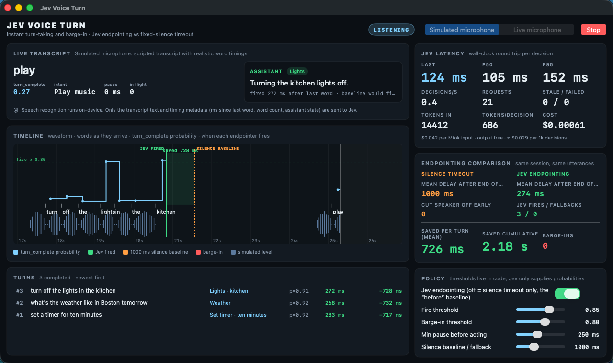
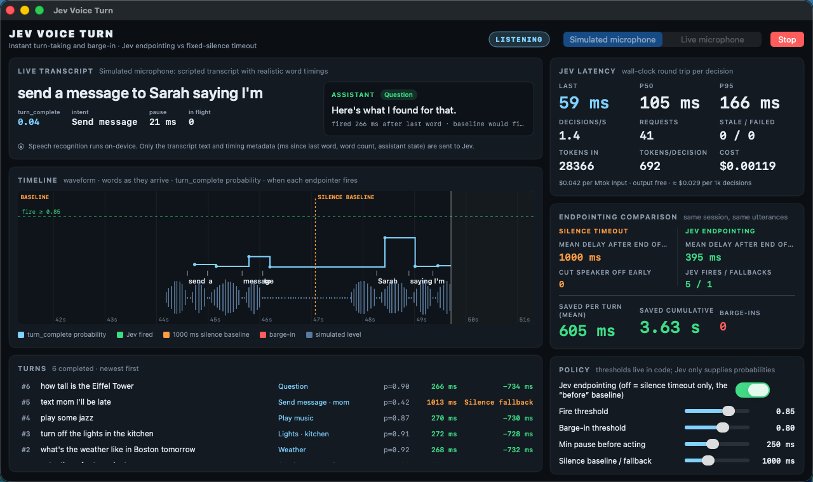
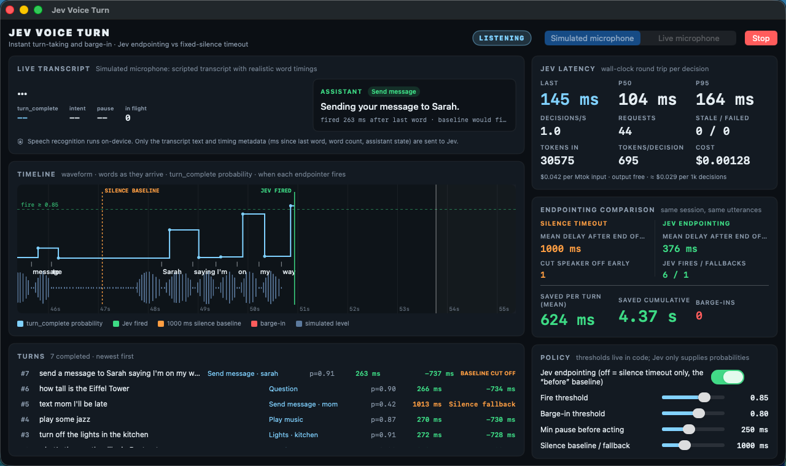
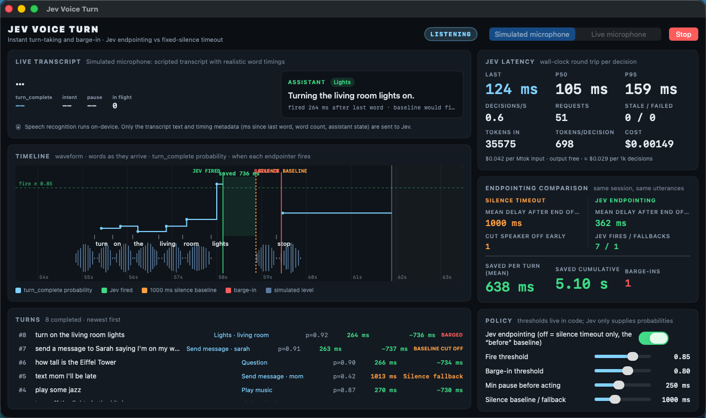
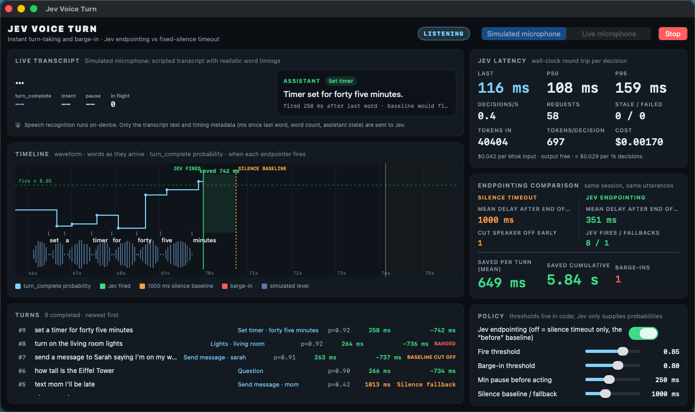

# Jev Voice Turn

Instant turn-taking and barge-in for a voice assistant on macOS. Apple's on-device
speech recognizer streams partial transcripts; on every partial update the app asks
Jev (TypeSafe System One) one fan-out request — *has the speaker finished?*, *what do
they want?*, *are they interrupting?* — and answers the moment `turn_complete` clears a
threshold instead of waiting for a fixed silence timeout.



## Why speed matters here

The biggest latency problem in voice assistants is *endpointing*. A fixed silence
timeout (typically 700–1500 ms) has to be long enough to survive a pause for thought,
so every single turn pays that full wait after the speaker has already stopped. It also
fails the other way: a hesitation longer than the timeout cuts the speaker off
mid-sentence.

Jev answers a typed question about the transcript in ~100 ms, so the app can fire as soon
as the words form a complete request and keep waiting when they clearly do not — both
decisions come from the same probability.

## Measured numbers (live run, simulated microphone, 2026-09-17)

One full pass of the scripted demo (10 utterances, 9 completed turns) against
`https://api.typesafe.ai/v1/systemone`, model `jev-latest`, from the demo VM:

| Metric | Value |
| --- | --- |
| Jev round trip, p50 / p95 | **108 ms / 159 ms** (wall clock, measured in-app) |
| Requests per session / decisions per second while speaking | 58 / ~1.4 |
| Input tokens per decision | ~697 (40 404 total; output ~130 per request) |
| Cost per session | $0.0017 ($0.042 per M input tokens, output free) |
| Mean assistant delay after end of speech — silence timeout | 1000 ms |
| Mean assistant delay after end of speech — Jev | **351 ms** |
| Time saved per turn (mean) / cumulative | **649 ms / 5.84 s** |
| Jev fires / silence fallbacks | 8 / 1 |
| Turns the 1000 ms baseline would have cut off mid-sentence | 1 |
| Barge-ins detected | 1 |
| Stale or failed requests | 0 |

The per-turn fire delay of ~260–280 ms is the 250 ms minimum-pause guard plus one Jev
round trip; the probability itself is usually above threshold on the last word.

Per turn (from the same run):

| # | Utterance | Intent · slot | p(turn_complete) | Jev delay | vs. baseline |
| --- | --- | --- | --- | --- | --- |
| 1 | set a timer for ten minutes | set_timer · ten minutes | 0.92 | 283 ms | −717 ms |
| 2 | what's the weather like in Boston tomorrow | weather | 0.92 | 268 ms | −732 ms |
| 3 | turn off the lights in the kitchen | lights · kitchen | 0.91 | 272 ms | −728 ms |
| 4 | play some jazz | play_music | 0.87 | 270 ms | −730 ms |
| 5 | text mom I'll be late | send_message · mom | 0.42 | 1013 ms | silence fallback |
| 6 | how tall is the Eiffel Tower | question | 0.90 | 266 ms | −734 ms |
| 7 | send a message to… (1.3 s pause) …Sarah saying I'm on my way | send_message · sarah | 0.91 | 263 ms | −737 ms, baseline cut off |
| 8 | turn on the living room lights → "stop" while speaking | lights · living room | 0.92 | 264 ms | −736 ms, barged in |
| 9 | set a timer for forty five minutes | set_timer · forty five minutes | 0.92 | 258 ms | −742 ms |

Turn 5 is an honest miss: Jev only gives "text mom I'll be late" 0.42–0.55, so the
deterministic silence fallback fired at 1000 ms with the correct intent and contact.
The fallback exists precisely so a low-confidence judgment costs nothing worse than
the baseline.

### Hesitation: the baseline cuts the speaker off, Jev waits





### Barge-in



### End of session



## How the Jev questions are designed

Every partial-transcript update builds one request (`Sources/TurnState.swift`). The
state is small, structured, and contains no audio:

```json
{
  "transcript_so_far": "set a timer for ten",
  "ms_since_last_word": 180,
  "word_count": 5,
  "assistant_state": "listening",
  "assistant_is_saying": null
}
```

Questions in the same request (fan-out, all independent):

- `turn_complete` (Noul) — "Has the speaker finished saying a complete request, so that
  the assistant should respond right now instead of waiting for more words?" The
  `false` criterion spells out what mid-sentence looks like: dangling function words
  (*for, to, in, the, and*), an action without its object.
- `intent` (Choice) — one of `set_timer`, `weather`, `play_music`, `lights`,
  `send_message`, `question`, `chit_chat`, `incomplete`, each with a one-line rubric.
- `is_barge_in` (Noul) — only added while the assistant is speaking; the state carries
  the sentence being spoken so "stop / wait / no / cancel" can be told apart from
  backchannel ("ok", "thanks").
- `timer_duration`, `room`, `contact` (Choice) — only added when a regex finds
  candidate spans in the transcript. The candidates *are* the choices (plus `none`), so
  Jev selects and code copies the exact substring; nothing is generated.

Jev supplies probabilities; all thresholds and actions live in code
(`Sources/TurnPolicy.swift`):

- Fire when `turn_complete >= 0.85` and the pause is at least 250 ms
  (guards against firing between two words of a still-flowing sentence).
- If `turn_complete < 0.35` the speaker is clearly mid-sentence, so the silence fallback
  stretches to 2.5× the baseline (2500 ms) instead of cutting them off.
- Otherwise the ordinary silence timeout (default 1000 ms) is the fallback.
- If there is no Jev answer at all (slow, failed, rate-limited) the plain silence
  timeout applies, so the app never stalls.
- Stop speech immediately when `is_barge_in >= 0.8`. If the interruption itself is a
  complete new request (`turn_complete >= 0.85`) it is answered directly; otherwise the
  buffer is cleared and listening resumes.

Requests carry a sequence number and are coalesced: at most one in flight, the newest
transcript is dispatched when it returns, and answers for a transcript that has since
changed are discarded. HTTP 429 triggers a 2 s backoff shown in the UI.

## UI

- **Live transcript** with the current `turn_complete`, intent, pause and in-flight count.
- **Timeline strip**: waveform, words as they arrive, `turn_complete` as a step line
  against the fire threshold, orange marker where the silence baseline fires, green
  marker where Jev fired, shaded "saved" band, red marker for barge-in.
- **Jev latency**: last / p50 / p95, decisions per second, request count, stale/failed,
  tokens, tokens per decision, running cost.
- **Endpointing comparison**: silence timeout vs Jev, mean delay after actual end of
  speech from the same utterances, cut-off count, fires/fallbacks, saved per turn and
  cumulative, barge-ins.
- **Policy** sliders for fire threshold, barge-in threshold, minimum pause, silence
  baseline, and a toggle to disable Jev (pure silence-timeout mode, the "before").
- **Turns** table with intent, selected slot, probability at fire, delay, and saving.

## Privacy

Speech recognition runs on-device (`SFSpeechRecognizer` with
`requiresOnDeviceRecognition` when the locale supports it). Only the transcript text and
timing metadata (`ms_since_last_word`, `word_count`, assistant state) are sent to Jev;
audio never leaves the machine. The UI says so under the transcript.

## Run

Requirements: macOS 14+, Xcode 15+, XcodeGen 2.46.0 (`brew install xcodegen`).

```sh
cd jev-voice-turn
export TYPESAFE_API_KEY=...        # or set it in JevVoiceTurn > Settings
xcodegen generate                  # optional; the .xcodeproj is committed
xcodebuild -project JevVoiceTurn.xcodeproj -scheme JevVoiceTurn -configuration Debug \
  -destination 'platform=macOS' -derivedDataPath build CODE_SIGNING_ALLOWED=NO build
open build/Build/Products/Debug/JevVoiceTurn.app
```

Launch from a shell that has `TYPESAFE_API_KEY` exported (Finder-launched apps do not
inherit shell variables); otherwise paste the key into Settings, where it is stored in
UserDefaults. The key is never logged or written to the repository.

Pick **Simulated microphone** (default; a scripted transcript with realistic word timings
and a synthetic waveform, clearly labeled in the UI) or **Live microphone**, then press
Start. Live mode prompts for Microphone and Speech Recognition permission
(`NSMicrophoneUsageDescription`, `NSSpeechRecognitionUsageDescription` in `project.yml`).

## Limitations

- The demo VM has no audio input device, so all measurements and screenshots above use
  the simulated microphone. Live-microphone mode is implemented with `AVAudioEngine` +
  `SFSpeechRecognizer` but could not be exercised on this machine.
- The assistant's replies are deterministic templates chosen from Jev's `intent` and
  slot answers, spoken by `AVSpeechSynthesizer`. Jev does not generate text.
- Fire delay is bounded below by the 250 ms minimum pause plus one round trip; on the
  measured connection that is ~260–280 ms after the last word.
- Short imperative texts ("text mom I'll be late") sometimes score below the fire
  threshold; those turns fall back to the silence timeout rather than firing early.
