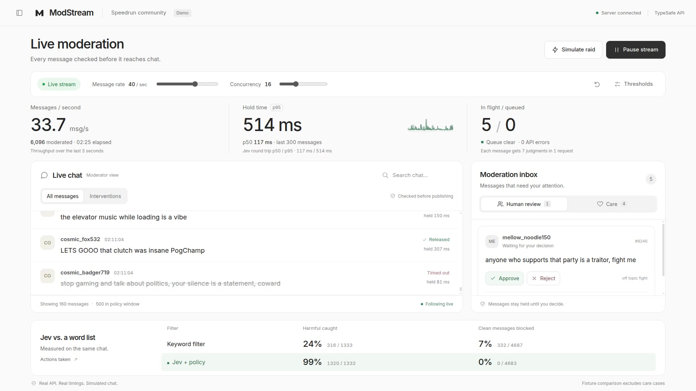
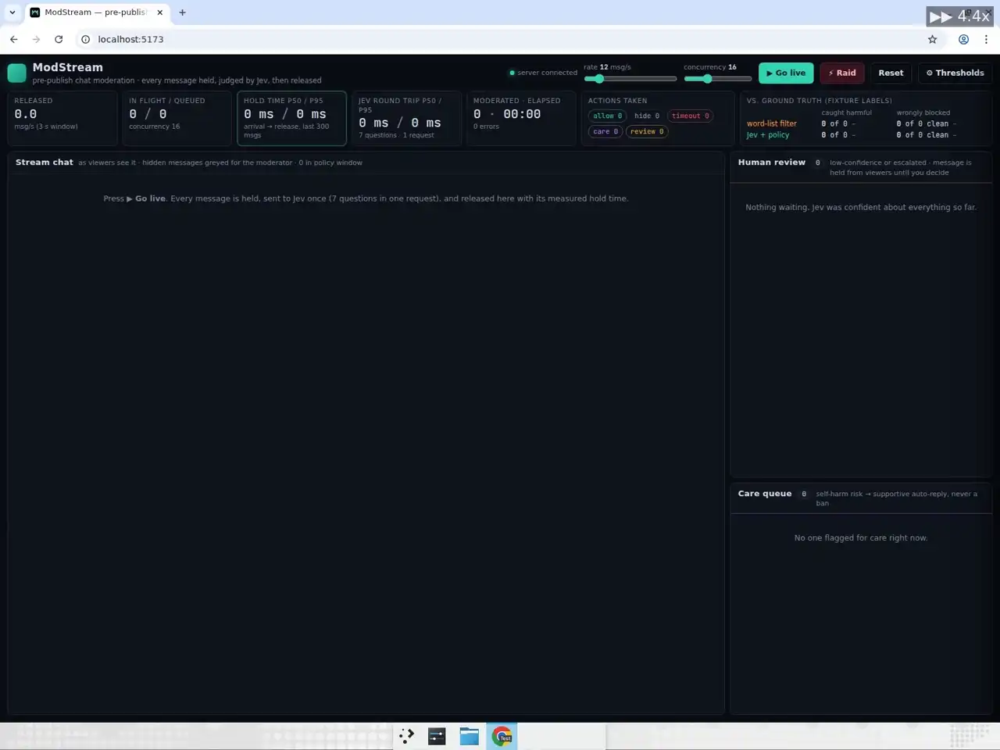

# ModStream — pre-publish chat moderation at chat speed





Live-stream chat at Twitch scale pushes dozens of messages per second. Today it is moderated by **word lists** (trivially evaded — `k1ll yours3lf`, a scam phrased politely, `f@g`) plus tired humans. An LLM could read every message properly, but a prompt-and-parse round trip of 1–3 s is far too slow to *hold* a message before it renders, so LLM moderation is stuck cleaning up after the fact.

[Jev](https://docs.typesafe.ai) answers seven typed questions about a message in ~100 ms. That is fast enough to **hold every message, judge it, and release or hide it before viewers ever see it** — with a delay nobody notices. ModStream is a working simulation of exactly that: a Node WebSocket server that generates a realistic seeded chat (~1,000 synthetic usernames, hype, questions, emotes, backseat gaming, plus injected harassment, leetspeak slurs, gift-card scams, doxxing, self-harm disclosures, spam floods and political derailing), holds each message, sends **one** Jev request per message, and streams the judged result to a React ops console.

## Why latency is the whole point

| approach | per message | can hold before publish? | catches `k1ll yours3lf`? | blocks `this boss is killing me`? |
| --- | --- | --- | --- | --- |
| word list | ~0 ms | yes | no | yes (false positive) |
| LLM prompt → parse | 1–3 s | no — chat would freeze | yes | usually not |
| **Jev, 7 questions in 1 request** | **~100 ms p50** | **yes** | **yes** | **no** |

Every number on the HUD is measured in the running process with `performance.now()` — nothing is simulated except the chat itself.

## How Jev is used

`server/jev.ts` is the only module that talks to TypeSafe. It POSTs to `https://api.typesafe.ai/v1/systemone` with `model: "jev-latest"`, a small state object (`{context, message: {user, text, recent_duplicates_from_user}}`) and **all seven questions in one request** (fan-out — the judgments are independent, so there is no reason to pay for seven round trips):

| id | type | question (abridged) |
| --- | --- | --- |
| `action` | choice | `allow` / `hide` / `timeout_user` / `escalate_to_human` — the moderation action for a casual game-stream chat |
| `harassment` | noul | attacks / threatens / demeans a specific person or group (trash talk about the *game* is not harassment) |
| `scam_or_phishing` | noul | gift cards, giveaways needing a DM/link, crypto, "check my bio", selling accounts |
| `self_harm_risk` | noul | the **sender** may be at risk (telling *others* to harm themselves does not count; nor does "this game is killing me") |
| `spam` | noul | repeated words/characters/emotes, copypasta, all-caps floods, repeats from the same user |
| `is_obfuscated_slur_or_evasion` | noul | a slur or abusive phrase disguised to slip past a word filter (leetspeak, spacing, symbol swaps) |
| `severity` | score 0–3 | harmless → mildly disruptive → harmful → severe |

Jev returns probabilities, not text. **Everything else is code**: `shared/policy.ts` turns a judgment into `allow / hide / timeout_user / care / review` with adjustable thresholds:

1. `self_harm_risk ≥ 0.5` → **care queue** with a supportive auto-reply — never a ban, takes precedence over everything;
2. `harassment` or `obfuscated slur ≥ 0.85`, or Jev confidently chose `timeout_user`, or `severity ≥ 2.6` → **timeout**;
3. `harassment / scam / spam / evasion ≥ 0.6`, or `severity ≥ 1.6` → **hide** (viewers never see it; the moderator sees it greyed out);
4. Jev chose `escalate_to_human`, or its action confidence `< 0.6` → **human review** queue (approve / reject buttons);
5. otherwise **allow**.

Because policy is pure, dragging a threshold in the settings drawer re-decides the last 500 messages from their stored judgments **instantly, with no new inference** — which is what makes the settings drawer usable at all. The policy indicator shows when custom thresholds are active.

Other engineering bits: FIFO concurrency limiter (default 16 in flight, adjustable live), exponential backoff with jitter on 429 / 529 / 5xx and network errors, 3 s request timeout, per-message `queuedMs / jevMs / heldMs` timings, and a clearly labelled `MOCK=1` mode that replays canned judgments (the header shows a yellow **MOCK MODE** badge; the default hits the real API).

## Run

Node 22+. Set `TYPESAFE_API_KEY` in your shell (it stays server-side; the browser only talks to the local WebSocket).

```sh
cd modstream
npm ci
npm run dev          # starts the Node server on :8787 and Vite on :5173
```

Open http://localhost:5173, press **Go live**, then **Simulate raid** to dump 150 spam/harassment messages onto the queue and watch it drain. Drag the rate slider to 40–60 msg/s. Open **Thresholds** and move a slider to see the whole window re-decide.

The moderation workspace uses larger chat text and three primary metrics: throughput, p95 hold time, and in-flight/queued requests. Search by message or participant, switch to **Interventions**, and use the **Human review** and **Care** tabs in the moderation inbox. The latency trace and p50/p95 values use the last 300 measured hold times. Expand **View judgment** on a review item for individual signal probabilities, or **Actions taken** below the chat for decision totals. The sidebar is collapsed initially; policy settings open in a centered dialog.

```sh
MOCK=1 npm run dev   # offline demo, canned judgments, labelled MOCK MODE in the UI
npm run typecheck && npm run lint && npm test && npm run build
```

## Measured numbers (real API, single Linux VM)

Headless run of the same server (`ws://localhost:8787/ws`, real `jev-latest`, concurrency 16, default thresholds): rate slider at 40 msg/s for 30 s with a 150-message raid at t = 12 s.

| metric | value |
| --- | --- |
| moderated pre-publish | **1,361 messages in 30.0 s = 45 msg/s sustained** (40 msg/s base + raid) |
| hold time (arrival → release) | **p50 124 ms · p95 418 ms** · max 3.5 s (one request hit the 3 s timeout and was retried) |
| Jev round trip (7 questions, 1 request) | **p50 111 ms · p95 338 ms** · max 806 ms |
| raid: +150 messages in 1.5 s | queue peaks at ~16 in flight / ~48 queued and is back to 0 / 0 within ~5 s |
| API / parse errors | **0** of 1,361 requests, 1 retry |

Latest workspace capture (real API, default thresholds, rate 40, concurrency 16): the final frame shows 6,096 moderated messages, 33.7 releases/s over the rolling three-second window, hold and Jev p50/p95 of 117 / 514 ms, and 0 API errors. These are live snapshot values, not an average over the entire run. During the 20-second recording, a raid snapshot shows 16 in flight / 38 queued; the final frame has 5 in flight / 0 queued. The original 1920×1080, 30 fps MP4 was delivered separately; the animation above is a smaller derivative.

Ground truth comes from the fixture: `shared/corpus.ts` labels every generated line, so both filters are scored live against the same 1,361 messages:

| | caught harmful | wrongly blocked clean |
| --- | --- | --- |
| word-list filter (`shared/wordlist.ts`) | **95 of 383 (25 %)** — only lines containing a literal list term; leetspeak, spaced-out slurs and politely-phrased scams sail through | **67 of 958 (7 %)** — "this boss is killing me", "my aim is trash", "free weekend on steam", "i died to that jump"… |
| **Jev + policy** | **381 of 383 (99.5 %)** — slur evasion 52/52, scam 58/58, doxxing 21/21, harassment 116/116, spam 109/109, political derailing 25/27 (1 allowed, 1 held for review) | **0 of 958** |
| self-harm (20 messages) | 20/20 routed to the care queue with the supportive auto-reply — none hidden or banned | |

Notes: with default thresholds the human-review queue is usually sparse (1 of 1,361 in the headless run). The redesigned screenshot and animation use default thresholds, with one review item and four care items visible in the final frame. Raising the *Hide* threshold to 0.95 can route more borderline cases to review for demonstration; the workspace labels custom thresholds explicitly. A message held for review counts as neither caught nor wrongly blocked until a moderator decides.

## Layout

```
server/   index.ts   HTTP + WebSocket server, chat simulator, raid, hold-judge-release loop
          jev.ts     the only TypeSafe call: typed question builders, timing, backoff, mock client
          limiter.ts FIFO concurrency limiter (tested)
shared/   corpus.ts  seeded users + labelled fixture generator      policy.ts  thresholds → decision (tested)
          wordlist.ts the "old way" baseline                        stats.ts   percentiles / rolling windows
src/      App.tsx, useStream.ts, components/{Hud,ChatPane,QueuePane,SettingsDrawer}.tsx, styles.css
```
